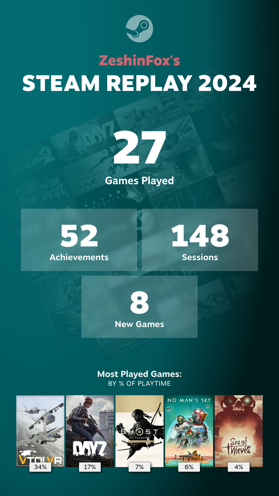

---
---
I know this isn't exactly 'professional', but we all have to unwind once in a while. Gaming has been a part of my life for many years - Less so ever since taking up Martial Arts and Motorcycling, but I do occasionally chill with a few rounds of Battlefield 4 or an hour or two in the Kerbal Space Program sandbox. Gaming has also been the background for a lot of my computer knowledge, especially when it comes to building computers and keeping up on the latest developments in CPU and GPU architecture. These skills still serve me today, whether it be for specifying a high-end system for use in research or building a custom gaming rig for a friend.

So I'm a PC Gamer. I've tried the occasional console - XBox 360, PS3, etc, but I always end up back at PC's (the hangout for the true Hardcore gamer - Mouse and keyboard FTW!).

### Steam Gaming Profile

Steamprofile badge by Steamprofile.com

Find me on [Steam](http://store.steampowered.com/) under [ZeshinFox](https://steamcommunity.com/id/zeshinfox/) - Come and play!

### Contact me via Discord
2c21aeda16de354ba5334551a883b481Discord is a new chat platform, which can best be described as Skype plus TeamSpeak plus IRC plus Steam Chat. I choose this over Skype due to previous security concerns with Skype with DDOS attacks.

Discord is super light-weight and an absolutely brilliant platform for gamers to use. It does have an overlay option similar to Steam, but I've never yet got this to work.

Find me on [Discord](https://discordapp.com/) under: **TFindley#6974**

### Buying Games
I largely buy my games via [Kinguin](https://www.kinguin.net/r/TFindley) (use this link to support me on Kinguin), Humble Bundle, Steam, UPlay or Origin.

### Streaming
I do occasionally stream games. Check me out out [YouTube](https://www.youtube.com/channel/UCTzlh2rZXFmI0D95hoc14Gw) / [YouTube Gaming](https://gaming.youtube.com/channel/UCTzlh2rZXFmI0D95hoc14Gw) to see if I'm streaming live, or for past streams.

I do also have a Twitch account (details coming soon), but I rarely use this.