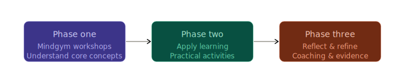

**Chartered Management Institute (CMI) Level 3 — Team Leader / Supervisor**
*Delivered by Multiverse in partnership with Mindgym*

Grade: **Distinction**

Started: April 2022 (at UKCloud Ltd) | Completed: October 2023 (at SiXworks Ltd)

The People Leadership Programme (PLP) is a 15-month accredited leadership development programme, culminating in the CMI Level 3 Team Leader | Supervisor apprenticeship qualification. The programme combines science-backed workshops, one-to-one executive coaching, peer learning, and applied workplace activities across four progressive modules — each designed to translate theory directly into practice.

See: [PLP Launch Booklet](<PLP Launch Booklet V3.pdf>)

---

## Programme Structure

The programme is built around four modules, each pairing Mindgym-facilitated workshops with hands-on applied activities and a written assignment submitted as part of an ongoing evidence portfolio.

---

### Module 1 — Managing Self *(Focus on Me · 8 weeks)*

The foundation of effective leadership is self-knowledge. This module explores personal strengths and blind spots through a range of profiling, feedback, and reflection activities. Key themes include understanding unconscious bias, developing emotional intelligence, and building time and energy management habits.

*Mindgym workshops: Give Me Strength | Me PLC*

#### Tools & frameworks

**Johari Window**
A self-awareness framework using four quadrants — open, blind spot, hidden, and unknown — to map what is known or unknown to yourself and others, highlighting areas for growth and feedback.

**SMART objectives**
A goal-setting structure ensuring objectives are Specific, Measurable, Achievable, Relevant, and Time-bound — used to build a focused Personal Development Plan.

**RedBull WingsFinder**
A strengths assessment identifying your top talents across four categories: creativity, thinking, drive, and social skills — used alongside StrengthsFinder to build a rounded strengths profile.

**Personal Development Plan**
A structured document used to capture development goals, actions, timelines, and progress — anchoring all self-awareness activities into a concrete plan for growth.

**SWOT analysis**
Applied personally to map Strengths, Weaknesses, Opportunities, and Threats to your leadership development over the next 6–12 months, informed by profiling and feedback results.

**360° feedback**
Structured feedback gathered from a range of colleagues — senior peers, direct reports, and collaborators — to build an objective picture of perceived strengths and development areas.

**16 Personalities**
A personality profiling tool based on Myers-Briggs typology, identifying traits across introversion/extraversion, thinking/feeling, and other dimensions to improve self-understanding and interpersonal awareness.

**Learning Styles test**
Based on the Honey & Mumford model, this assessment identifies whether you are an Activist, Reflector, Theorist, or Pragmatist — helping you understand how you best absorb and apply new information.

**StrengthsFinder**
A Gallup assessment revealing your top natural talent themes from 34 possible strengths — used to identify both realised and unrealised strengths and shape development priorities.

**Concentration Curve**
A tool for mapping your energy and focus levels across the working day, enabling smarter scheduling of high-demand tasks and more effective time management.

---

### Module 2 — Building a High Performance Team *(Focus on the Team · 12 weeks)*

Building on self-awareness, this module focuses outward onto the team. Core topics include motivational theory, coaching skills, active listening, and leading by example. Practical activities cover building shared goals, establishing team norms, and developing trust through structured individual engagement.

*Mindgym workshops: The In Crowd | Coach*

#### Tools & frameworks

**Team Canvas**
A facilitated workshop exercise that brings a team together to define shared values, goals, roles, and ways of working — creating alignment and a common sense of purpose.

**Team Norms**
A set of agreed behaviours and expectations co-created with the team, establishing how members communicate, make decisions, handle conflict, and hold each other accountable day-to-day.

**1-2-1 meetings**
Structured regular check-ins between a leader and each individual team member, used to build trust, understand individual needs, provide feedback, and reinforce team goals at a personal level.

**Coaching**
A leadership approach that uses open questions and active listening to help individuals explore challenges, unlock their own solutions, and develop confidence — rather than directing or advising.

**GROW model**
A widely used coaching framework structuring conversations across four stages: Goal (what do you want?), Reality (where are you now?), Options (what could you do?), and Will/Way Forward (what will you do?).

---

### Module 3 — Organisational Governance *(Leading for Impact · 12 weeks)*

This module tackles the broader organisational context in which leaders operate — governance, compliance, resource management, and stakeholder engagement. Activities include reviewing HR policy, delivering a cost and efficiency analysis, and building a stakeholder communication plan. Conflict management and building trust across an organisation are also key themes.

*Mindgym workshops: Influence and Persuade | The Big Picture*

#### Tools & frameworks

**Stakeholder Analysis**
The process of identifying all individuals and groups with a stake in a project, then assessing their level of involvement, impact, and communication needs — the foundation for the two mapping tools below.

**Circles of Influence and Concern**
A concentric-circle model mapping stakeholders across four zones: Circle of Control (can directly act), Circle of Influence (can shape outcomes), Circle of Concern (affected but limited reach), and No Control or Influence (outside scope). Placing stakeholders in the appropriate circle clarifies their reach, communication needs, and potential impact on a project.

**Engagement Matrix**
A 2×2 grid plotting stakeholders by Power (Y axis) and Interest (X axis) across four quadrants: Manage Closely (high power, high interest), Keep Satisfied (high power, low interest), Keep Informed (low power, high interest), and Monitor (low power, low interest). Used alongside the Circles of Influence to determine how actively to engage and communicate with each stakeholder group.

---

### Module 4 — Project Management *(Delivering the Goods · 12 weeks)*

The capstone module brings all prior learning together through the delivery of a real business project. Working through initiation, planning, execution, monitoring, and retrospective evaluation, this module develops practical project management skills. The emphasis is on demonstrating measurable, real-world impact within the organisation.

For my capstone project I applied the Agile SCRUM methodology — see [The Scrum Guide](https://scrumguides.org/scrum-guide.html) for a full reference.

*Mindgym workshops: Motivate | Negotiation*

#### Tools & frameworks

**Agile SCRUM**
An iterative project management framework organising work into time-boxed sprints with defined ceremonies (planning, daily stand-up, review, retrospective) and roles (Product Owner, Scrum Master, team). Applied as the delivery methodology for the capstone project.

**Project Initiation Document**
A formal document defining a project's scope, objectives, stakeholders, success metrics, constraints, and team structure before work begins — ensuring alignment before any sprint planning takes place.

**GANTT chart**
A visual timeline that maps tasks, their durations, and dependencies across a project schedule — used for planning and tracking progress against milestones.

**RACI matrix**
A responsibility assignment matrix clarifying who is Responsible, Accountable, Consulted, and Informed for each task or decision — reducing ambiguity and improving communication across the project team.

**Risk log**
A living document tracking identified risks throughout the project lifecycle, recording likelihood, potential impact, owner, and agreed mitigations — reviewed regularly to keep the project on track.

**Sprint retrospective**
A structured end-of-sprint ceremony for the team to reflect on what went well, what to improve, and what actions to carry forward — a core feedback loop in the Agile SCRUM cycle.

---

## Assessment & Qualification

The programme concludes with an End-Point Assessment (EPA) administered independently by the CMI, graded at Pass or Distinction:

- **Professional Discussion** (50%) — a structured interview supported by a portfolio of evidence built across all four modules
- **Presentation** (50%) — a holistic leadership presentation on a topic set by the assessor, with a live Q&A

---
