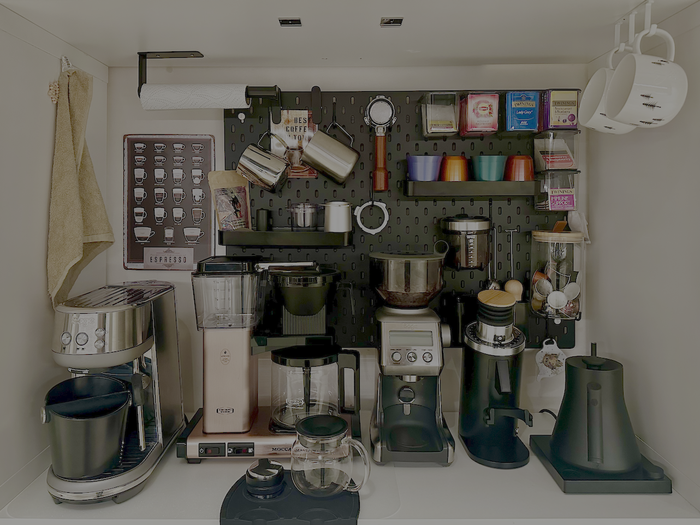

Our coffee station as it is now, from October 2025

Our coffee station as it was in February 2025

## Machines

- **Espresso:** [Sage Bambino](https://www.sageappliances.com/en-gb/product/bes450?sku=SES450BSS4GUK1)
- **Filter:** [Moccamaster KBG Select](https://www.moccamaster.nl/kbg-select) - Copper (no longer available)
- **OTG:** [AeroPress Original](https://aeropress.com/products/aeropress-coffee-maker)

## Grinders

- **Batch:** [Sage Grinder Pro](https://www.sageappliances.com/en-gb/product/bcg820?sku=BCG820BSSUK) (Connical bur)
- **Dose:** [MiiCoffee DF54](https://miicoffee.shop/products/miicoffee-df54-single-dose-coffee-grinder?variant=49257790439719) (Flat Burr)
- **Hand:** [TimeMore C3 Esp Pro](https://www.timemore.com/collections/coffee-grinder-manual/products/timemore-manual-coffee-grinder-chestnut-c3-esp-pro)

## Other

- **Kettle:** [Fellow Stagg EKG Pro](https://fellowproducts.com/products/stagg-ekg-electric-pour-over-kettle?variant=18635551080563)
- **Scales:** [OutIn Claro Coffee Scales](https://outin.com/products/coffee-scale)