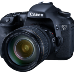

## Cameras (Current)

### Sony A7rII

The A7rII is Sony's 42MP Full Frame camera packed into a compact Mirrorless body (CSC, or Compact System Camera). The highly anticipated A7rII launched in 2015 to many good reviews. Not only had Sony crammed a Full Frame sensor into a mirrorless body (the first of its kind), but they had added 5-axis optical image stabilisation too. With this, their second generation Alpha-7 range, Sony were aiming (and succeeding) to dethrone Canon and Nikon from their dominance over the camera industry.

## Cameras (Previous)

### Canon EOS 1D Mark IV

My top-end professional body. Its weather proofing and solid build quality allows me to use it out in the toughest of environments without fear of damage. This body has accompanied me on wildlife and studio shoots alike.

This camera historically replaced a Canon 7D. While the build on the Mark IV is far superior, the sensor and AF systems feel very familiar to a prior 7D user. While the body is larger than a gripped 7D, it does not feel unfamiliar in the hand, with your fingers instantly finding the control hotspots which are in very similar locations to the 7D.The most notable difference is the removal of the Mode Dial. I can only say that this is the best choice that could have possibly been made. While shooting with the 7D, I would find I would knock the Mode Dial with my body or other hand, forcing the camera into Bulb Exposure or Aperture Priority mode. The next few photos would then be a flurry of confusion and panic until I reset the mode. Overall, the Canon 1D Mark IV has been the best investment in the photography world, and one that will stay with me for years to come. This camera has already seen its share of precious moments and famous shots, and it now feels like a very significant piece of what has made me the photographer I am today.

### Canon EOS 7D

The 7D is considered by many as the little sister to the 1D Mark IV. Its weather-proofed construction (equivalent to the 1Dn) gives super protection in environments where semi-pro cameras would never have dared ventured. With great low-light performance and hard-wearing magnesium-alloy body construction make for a rugid camera that does not break the bank or the back. The integrated flash contains a Speedlite controller, giving the photographer E-TTL wireless flash control (via InfraRed link) without the need of a Pocket Wizard Transmitter / Transceiver.I personally find the 7D's performance very similar to that of the 1D Mark IV, however its lighter build and smaller size allow it to be taken to places where a 1D Mark IV would be considered too cumbersome.This camera was my camera of choice throughout 2010, and produced some of my most published work.

### Canon EOS 50D

With the advent of Canon's DIGIC-4 processor came a whole range of new cameras. The Semi-pro entry was the Canon 50D. A significant upgrade from previous xxD range cameras, this camera set the bar for low light performance in its cost category. Today it is still favoured by many photographers.The xxD range holds a number of advantaged over the xxxD series of cameras. Most noticable is the LCD display on top of the body, giving a place where you can quickly view all the camera settings and freeing up the rear panel, improving the all-round shooting experience by giving the user access to all settings in one location. The addition of the control wheel on the back  allows for simultaneous shutter and aperture control in Manual.This was my camera of choice throughout 2009.

### Sony Alpha NEX-5N

My every-day carry-about camera body which recently replaced a Canon Powershot G12. Sony are still relatively new to the DSLR market, however their purchase of Minolta furnished them with a whole host of camera and lens technology. The NEX-5N was purchased due to its RAW capability, excellent low-light performance (equivalent to a Canon 5D mk.II (Full Frame DSLR)), relatively low cost and compact size. This camera allows me to produce professional quality work even when I am not carrying the 1D Mark IV. Its ultra compact size and variable-angle Display allows for a more casual and less obvious shooting style. This is very notable with Street photography. Shooting from the hip does not indicate to people that you are taking a photo, giving a more natural feel to the photographs.

### Canon EOS 650D

Canon's new DIGIC-5 processor premiered in the Canon 1DX and 5D Mark III earlier in 2012. Now their revolutionary processor comes to the consumer range with the Canon 650D (Kiss T4i for the Yanks). Its sensor performance now rivals that of the Canon 7D from 2010, and while its focus point and FPS performance is still nowhere near that of the pro-level cameras, this petite DSLR body performs more than adequately to be a very reliable and extremely well performing companion camera for those pro-body users.

This was my companion camera of selection to pair with the 1D Mark IV for 2012.

### Olympus Stylus 1

This awesome little camera was my go-to backup camera for 2013-2014. The f/2.8 28-300mm lens gives a superb range, while keeping the size and weight down to a minimum.

The photos outputted by the Stylus 1 often require very little in the way of post-processing, with the live viewfinder giving an accurate representation of exactly what will be produced, right from setting up the shot to the moment you press the shutter button.

### Canon EOS 400D

My first ever DSLR - the Canon EOS 400D. This was where it all began all those years ago, with the kit 18-55mm lens and a Tamron 70-300mm

### Fuji FinePix S7000

My first ever bridge camera, and one that I kept for many many years. A definitely favourite of mine.

## Glass (Current)

### Carl ZEISS Batis 85mm ƒ1.8

One of the most beautiful lenses that I've ever had the opportunity of using. This ultra-light lens boasts a wide ƒ1.8 aperture, onboard image stabilisation and OLED data display on the lens barrel, all with the signature ZEISS look and feel that accompanies every photo produced using this lens. While it is probably one of my least used lenses, every time I do get to use it I am always stunned by it's quality, and I think this is the perfect pairing for any camera in the Sony Alpha system lineup.

This lens is the only lens that I do not use with a lens filter (#LivingDangerously).

### Sony FE 16-35mm ƒ4 ZA OSS Vario-Tessar Carl Zeiss T*

My first ever wide-angle lens, and I have to say that I'm impressed. Boasting very similar dimensions and weight to the Sony FE 24-70mm ƒ4, this lens almost always finds a home in my day bag, or often than not, on the camera as my default lens of the day. While not super wide at only 16mm, it is more than enough, and this lens maintains good edge-to-edge sharpness and image quality.

### Sony FE 24-70mm ƒ4 ZA OSS Vario-Tessar Carl Zeiss T*

If I had to choose one lens to carry around all day, the Sony FE 24-70 would be it.  It's light-weight with good image quality and a good general range of zoom to be useful in almost every situation.

### Sony FE 70-200mm ƒ4 G OSS

Information Coming Soon

## Glass (Previous)

### Canon EF 24-70mm f/2.8L USM

A super lens for portraits and low-light photography. The f/2.8 aperture allows for extremely fast shots even in poor light. he weather-proofing allows this lens to be mounted to a suitable camera and carried through the wettest of shoots.

### Canon EF 70-200mm f/2.8L IS II USM

This lens spends 95% of thetime attached to the 1D Mark IV - The sharpest most enjoyable lens I have ever had the privilege of using, and the weapon of choice for every-day use.

This lens is suitable for portraiture, wildlife and sports, as well as many other types of photography. Its f/2.8 aperture allows for a shallow depth-of-field as well low-light shooting.

### Canon EF 400mm f/2.8L IS USM

Dubbed 'Old Painless' by myself and others  (in reference to the large mini-gun from the film "Predator"), this behemoth of a lens accompanies me to any wildlife or sporting photography opportunity. While far too heavy to wield hand-held, this monster finds a home atop a sturdy Gitzo monopod or tripod. For best results, use with a gimbal head!

Canon L-Series lenses produce superior quality images over other types of lenses, and the f/2.8 gives us the largest aperture range to work with, allowing for shooting in low-light scenarios without the aid of strobes or ancillary lights.

### Canon 15-85mm f/3.5-5.6 IS USM

Standard kit lens for the Canon 7D. An absolutely superb all-day carry-round lens. The increased zoom-range over the other kit Canon lenses gives far more options if you're confined to just a single lens.

### Sigma 50mm f/1.4 EX DG HSM

After heavily researching the 50mm lens market and eliminating the Canon EF 50mm f/1.8 (nifty-fifty) and the Canon EF 50mm f/1.4 USM, I settled on the Sigma 50mm f/1.5 EX DG HSM (Canon Fit). Part of the beauty of shooting with fast 50mm lenses is the ability to produce superb bokeh on portrait photos. The Sigma 50mm offering produced some of the nicest bokeh in the real world. While some photographers might worry that it does not have the premium build quality of a Canon lens, I  can assure you this lens is at least as well put together as anything Canon produce at this price bracket. While not quite L-series quality, the Sigma has a tough and impressive looking build and finish to it, and its image quality beats the equivalent Canon offering, giving you some very bokehlicious photos.

### Canon EF-S 18-55mm f/3.5-5.6 IS II

Standard lens offering that shipped with the Canon 650D. While nothing remarkable, this lens does offer a few advantages over previous Canon 18-55mm stock lens offerings. Most notably is the inclusion of Canon's second generation Image Stabilisation system, designed to eliminate camera shake when shooting at longer telephoto lengths or in low light. While this lens rarely goes out on assignment, it is a useful lens for when a DSLR is needed and weight is at an absolute premium. Always worth carrying as a spare in case of disaster though.

### Canon Extender EF 1.4x II

While not included in the 'every-day carry-around' kit, this extender finds its way into the bag when going on Wildlife shoots. The extra glass does reduce sharpness and clarity of the photos, however in the right situation can be used to great effect to capture elusive animals up close.

### Sony Alpha E-Mount 18-55mm f/3.5-5.6

With the NEX range of cameras, we are starting to see some very good quality lenses being produced. This 18-55 is certainly a shining example of where Sony are going with their Compact DSLR market. While small, this lens produces excellent professional quality results while still maintaining a low price. This is why it is always attached to the Sony NEX-5N body and my every-day lens / camera combo.

### Sony Alpha E-Mount 55-210mm f/4.5-6.3

A superb (if slightly slow) all-day carry-round telephoto lens. The best feature of this lens (apart from its sharp image quality) is its weight. It is a perfect companion for a NEX-range camera. It does not break the bank in terms of price, nor your back if you want to add it to a daypack to increase your range of zoom lengths.

### Sony Alpha E-Mount 16mm f/2.8

Certainly the smallest and lightest lens I have ever used, however still very well built with its metal exterior. This 16mm Prime does not always produce the sharpest of results, however is a perfectly acceptable quality for Landscapes.

## Lighting (Current)

### Sony HVL-F43M Speedlite

The Sony F43M offers the best balance between portability and power with full TTL metering, allowing for shooting from the hip without accurate flash metering. This is ideal in run-and-gun situations where manual strobes would take too long to configure accurately. The F43M includes the unique Quick Shift Bounce feature, allowing the head to be rotated to a portrait orientation, allowing for more even light distribution.

### Yongnuo 560 Speedlite System

The brilliant Yongnuo 560-series system offers superb performance at an intensely competitive price. While this flash system does without the automatic TTL system usually afforded to more expensive systems, its Wireless system allows for quick and easy control of all lights from a simple wireless commander unit (YN560-TX) on the camera's hotshoe.

Even though I shoot Sony, the Yongnuo system I use is designed for the Canon system. What I have found is the YN560-TX does not actually care what you're shooting with (as there is no TTL and all the flash powers are set manually), the only thing it needs is a trigger signal from the camera.

#### YONGNUO YN560-IV

The 560-IV series flashes provide amazing power in a portable yet rugged build, making these the ideal strobes for mobile studio setups where AC power is unavailable. This flash provides a very cheap and reliable alternative to any first-party flash, so long as you don't mind the lack of TTL. I use the 560's exclusively paired with a YN560-TX Wireless Commander module for off-camera flash control.

I now own 5 of the 560-IV's. During their use, I've had one unit die on me for no reason. Amazon accepted the return and refunded my money so I could purchase another.

#### YONGNUO YN560-TX

The wireless commander unit that sits atop the camera. This unit has the ability to wirelessly control the power and zoom of any YN560-IV that is on the selected channel. It has six discrete sub-channels which allows for 6 different power/zoom combinations. Any number of flashes should be able to exist on these channels.

In using the YN560-TX, I have had nothing but 100% reliability. The flashes fire every time, and there is never any sync or timing issue with the camera.

### Backgrounds

- Lastolite HiLite Background 8ft x 7ft (2.5m x 2.15m)
- 3m Background Support System with White Muslin background

## Lighting (Previous)

### Canon Speedlite System

The Canon series of Flashes are excellent value and performance as portable strobe / studio lighting. While not as simple to control as the Nikon CLS (Creative Lighting System), the Speedlite range do offer a wide range of flash powers and features. The Canon 430EX II is the most pleasing flash of the range, and certainly one of the best bang-for-your-buck deals. It does not offer any master control functionality with which to control other flashes (this feature being exclusive to the 580EX II), when combining two or more with the Pocket Wizard FlexTT wireless transceiver system produces a very powerful portable off-camera strobe setup with full E-TTL functionality. My combination of choice is currently Three Canon Speedlite 430 EX II flashes.

### Pocket Wizard FlexTT / MiniTT system

Pocket Wizard are already an established name in the strobe market with their range of radio triggers. They have gone one step further in their creation of one of the most useful accessories to any strobe photographer in the form of the FlexTT / MiniTT system. This radio trigger allows hotshoe flash-guns to be mounted on the FlexTT Transceiver, and fired off-camera from another FlexTT or MiniTT. The transmitter / transceiver atop the camera communicates the full E-TTL data from the camera / lens to the flashes, allowing for fully automatic strobe lighting. When combined with the AC3 Zone Controller, multiple zones of flashes can be independently controlled by setting the power in relation to the Flashes Exposure Control and E-TTL settings, or fully manually as a flash power. The units can also be used to trigger studio strobes in Trigger mode, effectively replacing the need for any other remote trigger. This flexible and scalable system are always in the camera bag and ready to go, in the form of three FlexTT5 Transceiver's, one MiniTT1 Transmitter and one AC3 Zone Controller.

### Lencarta ElitePro Strobes

These mains-powered studio strobes are used when mains power permits, and / or when the Canon Speedlite system just  won't cut it. Two 300w Strobe heads and a single 600w Strobe head make up a portable but professional quality lighting rig that produces some very pleasing results. The head-fitting on these lights is the industry-standard Bowens S-Fit, giving access to a whole market of first and third party modifiers and accessories.

## Bags

### Think Tank Airport International LE Classic (v2.0)

When they go on a shoot, most photographers like to carry the kitchen sink with them, and if there is one type of bag that can not only carry it, but can store it comfortably with plenty of padding, then the Think Tank Airport series of roller cases would certainly be it!

This is the bag that carries 90% of my gear and goes straight into the car as-is. With plenty of pockets for camera bodies, lenses, accessories and everything else under the sun, this is my go-to storage container which looks good but is secure and safe.

When on-site, if a roller bag is not practical, then the required gear is transferred to my Think Tank Steroid Belt system.

### LowePro Whistler BP 350 AW

The LowePro Whistler BP 350 AW was designed in the Canadian Rockies by photographers working in the most extreme of environments. This is without a doubt the mother of all photo backpacks. This bag offers the best combination of camera gear space and day-pack, all wrapped up in an ultra rugged design that is already water resistant but than be further improved with the use of the included rain cover.

The internal camera compartment offers a ridged shell to house your camera gear, with rear access which protects your gear from nimble-fingered opportunists.

The front-side of the bag offers a compartment which is waterproofed from the rest of the bag, which you can use to store your non-camera gear, and can be used to store any wet gear and allow it to dry. The compartment expands as needed, and can be compressed down using the two compression straps along the front. These same straps connect to straps on the side of the bag which can be used to carry skies, trekking poles or other long items.The top of the bag offers another large compartment which would be perfectly suited to carrying delicates such as Ski Goggles.

This bag has accompanied me across nearly 3000KM of New Zealand during my 2016 tour of both islands. During this time I had it fully loaded with my Sony A7rII kit and a wide range of extra accessories.

### LowePro ProTactic 350 AW

The LowePro ProTactic 350 AW is a small yet spacious backpack with a new and unique trick up its sleeve. The outside of the bag features MOLLE / Webbing loops which allow you to expand the bag as needed with pretty much any sort of pouch or accessory you can think of. The MOLLE system is widely used by Army personnel on tactical gear.

The shell of the bag is a semi-rigid construction with four access points for camera gear. The top (perfectly sized for a DSLR without a grip, or a Mirrorless with a grip) and the left and right side access for lenses and accessories. The rear panel gives you access to all compartments in the bag.  Inside of this rear panel is a small laptop compartment which is big enough to house a Macbook Air 11/13, or a Surface Pro 4.

My external configuration for this bag includes a Tear-away medical pack which I keep fully loaded just in case.

This bag accompanied me through 2000KM of Canadian Rockies during my 2015 tour. During this time

### Kata HB-205 GDC Hiker Backpack

A large backpack with 6-point harness system for easy comfort while carrying. This bag comfortably fits the Canon 1D Mark IV with a 70-200mm f/2.8L IS II USM attached, a 24-70mm f/2.8L USM, both camera hoods, weather covers, 2x Pocket Wizard FlexTT5's and 2x Canon Speedlite 430 EX II's, with room for one or two extra bits inside, an iPad in the front, and a waterbottle and Tripod or Monopod on the sides. This bag carries everything and more needed for a long day's shoot, and is perfect for any shoot that requires traveling by foot over longer distances.

### Kata DL-B-210 Bumblebee D-Light Backpack

My Kata DL-B-210 is my every-day backpack that  gives me something to carry a reasonable amount of gear and supplies that I  can use both as a photographer and when disguised as my alter ego; a not too mild-mannered computer geek. The main camera equipment compartment is roomy enough to house up to four lenses and a fifth mounted on a body (without Grip). This leaves the top section of the bag totally empty with room enough to carry a lunchbox, can of drink, first-aid kit and a few assorted other items. This backpack also features a 15-inch laptop compartment (which normally houses a bit of paperwork and my Android tablet), and two final smaller pockets - One on the front with room for pens, wallet, phone etc - the second on the side of the bag with room enough for maybe a mobile phone and a cable or two. On the other side of the bag is a elasticated pocket that can be used with the accompanying strap to carry a tripod, or on a more average day to carry a bottle of drink.

While I am certain the DL-B-210 could be adjusted to carry a Pro body with Grip with minimal sacrifice to the lens area, I choose to remain with a Canon 650D for my every-day carry-around body, almost always with a Sigma 50mm f/1.4 attached and the 18-55mm kit lens as backup.

As with all backpacks, the most important feature is how comfortable it is to carry around. The answer for this bag is 'Very comfortable'. While it does not have the same advanced harness system that the HB-205 has, the shoulder straps paired with the waist strap and chest strap provide a comfortable and well-padded (if not brilliantly ventilated) experience. The most important feature of this bag though is its weight. When empty, the bag is shockingly light-weight. This is extremely important when carrying it for extended periods of time, or when traveling abroad on charter airlines when every gram of weight is at a premium (less you get charged over-weight baggage fees).

You can purchase the Kata Bumblebee 210 here from Amazon UK.

## Accessories

- 3 Legged Thing Tim, with 3 Legged Thing AirHed 0
- Gitzo GM3340L Monopod with Manfrotto 357 Plate
- Gitzo GT3531S Series 3 Carbon Fibre Tripod Legs
- Manfrotto MVH500AH (502HD) Video Head
- Manfrotto 393 Long Lens Bracket
- Storm Jacket Camera Covers
- Garmin GPSMAP 62s
