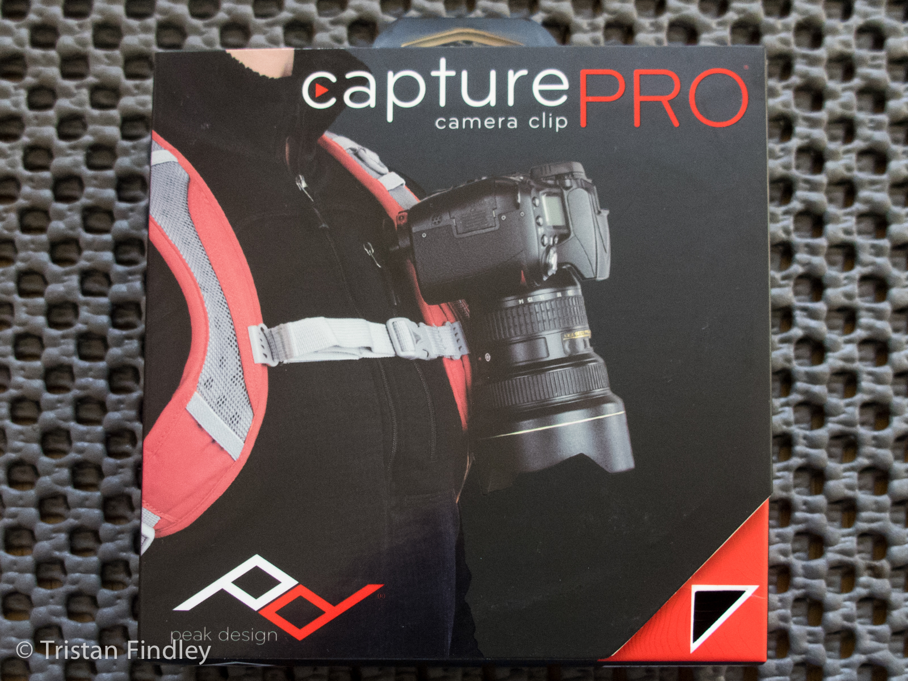

Peak Design are a USA-Base company who started out in 2010 with the Capture Clip, their first camera clip that was designed to solve camera carrying problems of creator Peter Dering. The original design pioneered on [Kickstarter](https://www.kickstarter.com) [Capture Camera Clip System](https://www.kickstarter.com/projects/peak-design/capture-camera-clip-system) **$364,698**. A brief history of the company can be found on [About Us | Peak Design](https://peakdesignltd.com/about/) their website, or on [Capture Camera Clip System: How to Lose 20 Pounds in 3 Seconds](http://news.smugmug.com/2012/01/05/capture-camera-clip-system-how-to-lose-20-pounds-in-3-seconds/) - The SmugMug Blog.



## Peak Design Camera Clips

At their heart, the Peak Design Camera Clips are designed to allow the user to clip it pretty much anywhere, giving you a mounting / anchor point for your expensive camera gear. Peak Design's promotional video shows the clip mounted in various places in various situations, all with quite a large variety of different payloads.

It is important to note that the Capture Clip does not magically reduce the weight of your camera gear - If carrying a Canon 1D Mark IV and a 70-200 f/2.8 IS II is too much for you when you're cycling around the New Forest, then Capture Clips wont make it any better. What they will allow you to do is mount your camera gear on your person in a whole new way.



The clips have come a long way from their original inception and release on Kickstarter in 2012. In 2013, Peak Design drastically redesigned the Capture Clip with a far more modern and streamlined look.

The current generation of Peak Design Camera Clips come in two major flavours: **Capture**, or **Capture Pro**.

## Peak Design Capture Pro

- **SKU/Part Number:**
  - **with ARCAplate:** CCC-2.0PA
  - **with DUALplate:** CCC-2.0PD
  - **with MICROplate:** CCC-2.0PM

### Specs

- **CapturePRO Weight:** 110g
- **ARCAplate Weight:** 30g
- **DUALplate Weight:** 34g
- **MICROplate Weight:** 22g
- **Clip Dimensions:** 4.1 in (10.4 cm) x 2.05 in (5.2 cm) x 1.1 in (2.8 cm)
- **Warranty:** Lifetime

The Capture Pro comes in three options. The following pictures and information are from the Peak Design Ltd website:

---

**ARCAplate**

This is our standard PROplate™. Fits most ARCA tripod heads, slides into Capture in 4 directions, 4 loops for Micro Anchors™ or hand straps.

---

**DUALplate**

Got a Manfrotto® RC2 tripod head? You want DUALplate™. Fits in Manfrotto RC2 and ARCA tripods, slides into Capture in 2 directions, and contains 2 strap loops.

---

**MICROplate**

If you're primarily using Capture with a slim-body or point-and-shoot camera, consider MICROplate. Extra-small footprint, fits ARCA tripods, and has 1 strap loop.

---

I personally opted for the Capture Pro with Arca Plate, as this provides the best generic tripod head compatibility, and is compatible with a 3 Legged Thing tripod head that I use.

### Unboxing


  
  
  
  
  


Upon receiving the Capture Pro, I was amazed with the quality of the packaging. The box definitely has a premium look and feel not usually associated with a product at this price range. Another thing - the box was much smaller than I expected it to be!

Once you get all the lovely packaging off your Capture Pro, you'll find the Capture Pro Clip, the plate of your choice (ARCAplate is pictured), a pouch, an Allen key for tightening the plate to your camera, and Quick Setup Guide.

### The Capture Pro Clip

The Capture Pro Clip is manufactured (almost) entirely from  from Aluminium. A black anodised finish covers most of the product, with the section below the plate mounting being exposed in silver with the Peak Design logo, the Plate Lock and the Quick Release button. On the left and right extremes of the plate are thumb screws that secure the front plate to the back plate, and also form the sandwich that locks the plate to your strap, belt or bag.

On the left of the clip is a red plastic button that triggers the quick release mechanism that keeps the plate locked to the clip. This button can be turned clockwise to disable the quick release button, and then counter-clockwise to activate it again. This prevents you from accidentally pressing the button, but even when locked does not prevent you from sliding the plate into the clip.

On the right of the clip is a Plate Lock knob that allows you to increase the friction on the plate once it is inserted into the clip. Doing this will remove any shake / rattle from the plate, and also prevent easy removal from the clip. I would recommend reducing the friction on the plate before trying to remove it from the clip, otherwise you might damage the finish on your plate. While the usefulness of this plate might not seem readily apparent, once you combine the clip with the POV Kit (reviewed below) it is a very useful feature!


  
  
  
  
  
  


### The ARCAplate
As explained further up, the Peak Design Capture Pro clips are available with three different plates. I went with the ARCAplate option as it gave me maximum compatibility with other ARCA standard plates and accessories, of which there are loads!

The ARCAplate looks like your typical small-style tripod quick-release plate made of black aluminium. Atop the plate (and surrounding the center bolt) is a red rubberised surface that provides a good amount of friction against your camera body. Around the outside of the plate are four tethering points for neck or wrist straps, or for the Peak Design<a title="Peak Design on Kickstarter - Slide and Clutch" href="https://www.kickstarter.com/projects/peak-design/slide-and-clutch-versatile-camera-sling-and-hand-s/" target="_blank" rel="noopener"> Clutch</a> or <a title="Peak Design - Cuff" href="https://peakdesignltd.com/store/cuff" target="_blank" rel="noopener">Cuff</a>


  
  
  


The biggest and most pleasant surprise with the  ARCAplate is that the bolt includes a D-Ring that is fully compatible with camera straps from manufacturers like <a href="http://www.amazon.co.uk/s/?_encoding=UTF8&amp;camp=1634&amp;creative=19450&amp;keywords=black%20rapid&amp;linkCode=ur2&amp;qid=1404138077&amp;rh=i%3Aaps%2Ck%3Ablack%20rapid&amp;tag=tfindphoto-21" target="_blank" rel="noopener">Black Rapid</a>. I personally use this with my <a href="http://www.amazon.co.uk/gp/product/B0056ACQU6/ref=as_li_ss_tl?ie=UTF8&amp;camp=1634&amp;creative=19450&amp;creativeASIN=B0056ACQU6&amp;linkCode=as2&amp;tag=tfindphoto-21">Black Rapid RS-Sport Strap</a> as it gives me the best of both worlds of a Tripod Mount, a Shoulder Strap, and a Belt/Bag Mount.

### In Use

I've been experimenting with the Peak Design Capture Pro for over a month now, and have certainly found it to be a flexible product.

What is it like to carry a large weight on? Well, while I wasnt confident enough to mount my Canon 1D Mark IV to it and hang it off my bag or belt, I have been comfortable enough to use it with my Canon EF 70-200 f/2.8L IS II USM - Attaching the ARCAplate to the lens collar gives me a permanent ARCA attachment for my 3 Legged Thing tripod, and also allows me to suspend the lens from my bag when I'm using larger lenses - this is incredibly useful when I'm shooting wildlife. Does the mount comfortably hold the 1.5Kg that this lens weighs? After having the Capture Pro mounted to my bag for an entire day with a 70-200mm f/2.8 being swapped on and off, I can happily say that it is comfortable to use, even with heavier payloads. As for any physical discomfort with the Capture Pro digging into my peck or shoulder, at no point did I notice it, although I did spend some time getting the positioning absolutely spot on before the day of the shoot. With all camera controls being on the right of the camera, I mounted the Capture Pro on the left side so that it did not obstruct my main shooting arm which would be naturally closer to my body, while my left arm would be further extended to support the lens or whatever support I was using. This left placement is also ideal for use with the POV kit, which I will discuss later on.

## Conclusion

The Capture Pro by Peak Design is one of those products that I didnt immediately fall in love with. The Capture Pro certainly has its uses, and I think that if I had a different bag and camera setup, I would probably love it more. It has its uses, and it has its benefits. The biggest for me as a stand alone product would be as a clip system for either a smaller Bridge or Compact-System Camera, or as a belt holster for a field audio recorder for recording off-camera audio. Personally I feel that this Capture Pro clip could be the dream of most boom operators who are using smaller professional field recorders such as a Zoom H6 or Roland R-26 along with a boom mic, or just for a stand-alone DSLR Video shooter who needs to mount a Mic on-camera but wants off-camera recording via a field recorder.

The biggest boon is the addition of the D-ring on the bottom of the tripod plate, and the Arca Compatibility. Both make this an exceptional product for CSC owners who want to chop-and-change with different ways of carrying gear, or for those who want to be able to use a belt clip but also a tripod without having to change the plate on the camera.

Over all, the clip feels a touch small in some regards. It is clearly targeted at the emerging CSC market. I just wish it was a touch larger

As I am currently a Canon DSLR shooter who prefers f/2.8 lenses, the size and weight of the gear I use far and exceeds the capabilities of this dinky little clip system. I far prefer the capabilities and build quality of the Spider Pro holster range.

## Peak Design POV Kit

- **SKU/Part Number:** POV-1

The POV kit was designed by Peak Design to allow you to attach a GoPro or other action camera to your Capture Clip to take advantage of the ability to mount the clip to your rucksack strap. While I believe that the POV Kit was designed primarily with the GoPro in mind, it is by no means limited to just the GoPro, and rugged cameras such as the Olympus Tough range of cameras.



The POV Kit was the primary reason for me purchasing a Capture Pro clip, as I needed a method of mounting my GoPro to myself without drawing too much attention. While the official GoPro Chest Mount is an excellent product (and one that I now frequently use for skiing) I don't find it very useful or visually pleasing to others having a camera mounted in the middle of your chest. Also, you look like a bit of a dork wearing the chest harness unless you're doing an extreme sporting activity.

### Unboxing
As with the Capture Pro clip, the POV kit comes in a high quality white box with various product photos on it. As with the clip, the box was far smaller than I was expecting.


  
  
  
  
  


Even over a week after I've received the product, I'm still amazed at how much Peak Design managed to cram into such a small package.

In the box is a flat plate with a standard GoPro mount, a tripod mount plate (3/4-inch thread), a thumb bolt, a GoPro arm, a stabiliser pad, two long plate thumbscrews, an allen key, a storage bag and a quick setup guide.

### Mounting the capture Clip with the Stabiliser Pad

Included in the POV Kit is a stabiliser pad. This provides a thick padding behind whatever it is you wish to mount the capture clip to, and helps reduce any vibration. As the standard Capture Clip is designed to be mounted to a belt (or similar), the standard screws are not long enough to mount the Capture Clip to a bag strap (with or without the stabiliser pad), so Peak Design have included two longer screws that replace the existing screws in this situation. The front of the Capture Clip against the bag strap, and then the stabiliser pad goes behind the bag strap, secured in place with the back of the Capture Clip and all sandwiched together with the provided screws. It all seems a little much when putting it on for the first time, but it really does work well!

### Attaching the POV Kit to the Capture Clip

Two different mounting methods are available to you when you purchase the POV Kit, depending on which camera you're looking to use- you can use the arm to mount your GoPro to the clip (this requires the use of a standard GoPro Thumb Screw to mount the camera shell to the arm), or you can use the flat tripod-mount plate to mount a generic action camera or Point-and-Shoot camera to the clip. Both methods start by utilising the POV plate. The plate itself is made of high quality durable plastic, which inserts into the Capture or Capture Pro Clip just like a standard tripod plate. Next you attach either the standard tripod mount or the GoPro arm. Both attach to the plate using the supplied thumb bolt, which is very similar to that used by GoPro for all of their mounts.

When using the standard tripod plate, the camera attaches to the plate using a standard 3/4-inch tripod bolt. This is tightened using a screwdriver or coin, and the top of the plate is rubberised to prevent any rotation from the camera.The plate itself allows for the camera to be tilted Up and Down, and the tripod plate will allow the camera to be rotated Left and Right.

When using the GoPro arm, the GoPro camera attaches to the arm as it would to any standard GoPro mount. Simply line-up the two plastic fins on the bottom of the GoPro case between the three that are on the arm, and push the mount into place. Now using your GoPro Thumb Screw (as supplied with your GoPro camera) insert the screw through the hole, securing the camera to the arm. In this configuration, the GoPro arm is able to rotate Left and Right through about 90-degrees (45 left, 45 right) and the camera itself can point straight ahead or down (this can be reversed by simply mounting the POV plate into the clip upside down, then inverting your footage in post-processing).

Either mounting solutions only give you movement in two planes. To compensate for any rotation in the camera (in relation to the ground or your person) simply mount the Capture Clip at a slight angle when mounting it to your bag. In testing, this works on normal rucksacks, as well as on sling-style bags - Once the clip is locked down onto a bag strap, it doesnt move!



When the GoPro is attached, the connection from the GoPro to the clip and the clip to you is very secure. It never feels like the assembly will come adrift from your bag, nor that the POV mount will come loose from the clip

### Where to mount your Capture Clip with POV Kit
There are a number of places to mount your POV kit. The most obvious (and probably most useful) is on the arm strap of your rucksack. With the GoPro facing forward, the best strap is the left (as this biases the lens on the GoPro more towards the centre of your chest) and at around the same height as your armpit (this keeps it clear of your arm movement and stops it digging into your pecks during your normal movement). For the photographers among you, mounting the GoPro here should give you a consistent forward view even when your camera is raised to your eye, as your left arm / hand (used to support the body or lens) sits slightly lower than your right (used on the shutter button and controls).

One of the more unusual mounting points that I've seen is on a ski-boot. A really helpful video from [GoPro Tips and Tricks](https://www.youtube.com/channel/UC15_JWyO0xsrV-W-pYdFtBQ)explains how:



## Conclusion
The POV Kit along with a Capture Clip is an extremely versatile solution. It gives you a lot more flexibility than the GoPro Chest Mount when using it for your GoPro HD Hero camera. Is it a replacement for the GoPro Chest Mount? I would personally say No, but I would also say that it is worth owning both! My chest mount is used exclusively when I ski. My Capture Pro and POV kit is used when I'm doing less extreme activities, or simply want a first person view of the goings on for the day.

My one and only complaint about the POV kit is that the actual parts themselves are made out of plastic. Granted, it is high quality plastic, but still plastic. Given that the Capture Clips are almost entirely metal construction, I would prefer the POV kit to be made out of the same material. Maybe Peak Design could offer a POV Pro kit which has more options and metal construction.

## Links

- [Peak Design Ltd](https://peakdesignltd.com/)
- [Facebook - Peak Design](https://www.facebook.com/peakdesignltd)
- [Twitter - Peak Design](https://twitter.com/peakdesignltd)

## Disclaimer

Some photos of the Capture Pro and related accessories are courtesy of Peak Design Ltd.

This review is not sponsored or commissioned by Peak Design Ltd or any of their affiliated companies