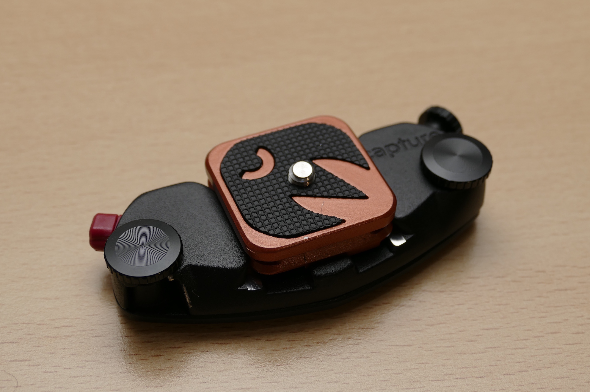

So this is a bit of a niche post, but I figured it was worthy of a little bit of attention. Those of you who are UK and US based photographers have probably come across the company '3 Legged Thing', makers of some truly lovely tripods. Recently, 3 Legged Thing have teamed up with Peak Design, another company that I have great respect for. This partnership appears to go beyond the simple of selling Peak Design products on the UK 3 Legged Thing website.

In recent months 3 Legged Thing have been teasing us all with photos of a new tripod Quick Release plate which is compatible both with the 3 Legged Thing tripods and the Peak Design Capture Pro clip. I figured I'd ask the staff at 3LT if they were available yet, and low and behold they sent me one out along with some spare parts that I'd requested for my 3 Legged Thing Tim tripod, so I figured that I'd return the favour by writing a little about it, and comparing it to the other tripod plates.<!--more-->

## The Plates - 3 Legged Thing meets Peak Design

So where to begin? First I should mention that I'm review this as an owner of a 3 Legged Thing Tim tripod, which has an AirHead 0 ballhead. Newer 3 Legged Thing tripods have the newer Mohawk Ballhead which I have not yet tested.

There are three plates that are worth of mention here, and we'll start with the two standard plates that ship with the 3LT Airhead 0 and the Peak Design Capture Pro clip respectively.

## Plate Compatibility Matrix

| Plate                               | 3LT AirHead 0 Compatible | PD Capture Pro Compatible | ARCA Compatible | 3LD Mohawk Compatible | Manfrotto RC2 Compatible |
| ----------------------------------- | ------------------------ | ------------------------- | --------------- | --------------------- | ------------------------ |
| 3LD AirHead 0 QR Plate              | Yes                      | No                        | Yes (1 Axis)    | Possibly              | No                       |
| Peak Design ARCA plate              | Yes (No safety pin)      | Yes                       | Yes (2 Axis)    | Supposedly            | No                       |
| 3LT Peak Design Compatible QR Plate | Yes (No safety pin)      | Yes                       | Yes (2 Axis)    | Yes                   | No                       |
| Peak Design ProPlate (not testd)    | Yes (No safety pin)      | Yes                       | Yes (2 Axis)    | Supposedly            | Yes (with adapter)       |

### 3LT AirHead 0 QR Plate


  
  


The standard plate that ships with the 3LT AirHead 0 is a well designed if slightly basic tripod plate. The plate is a rectangular affair, constructed out of full metal with two black rubber chevrons on the top to give the camera something to grip onto. The included screw is the standard 1/4-inch with the bottom being fairly flat, and requires a flat-blade screwdriver or coin to tighten. This screw can apparently be replaced by the Black Rapid FastenR-T1 (which is designed for Use with Manfrotto RC2 Plates), which would give a loop for a Black Rapid strap, as well as a decent way of finger tightening.

The plate itself fits securely onto the AirHead 0 head and is retained there with the safety pin on the head (more about this later). The plate is also ARCA compatible on one axis (down the short side of the rectangle). It is not compatible with the Peak Design Capture clips.

At time of writing, this 3LT QR plate and associated AirHead 0 appear to have been discontinued, and replaced by the Mohawk head and the new 3LT Peak Design compatible QR plate.


  
  


Peak Design's ARCAplate offering is a good all-round solution. The plate is square and made entirely from metal (finished in black) with a red rubber top which covers most of the surface of the plate. This provides good grip to the camera body. On the four sides of the plate are strap loops, which are great if you want to use it with one of Peak Designs straps, or a third party hand-strap. The screw is the standard 1/4-inch thread. This is tightened by a Alum Key (hex), or can be finger tightened by raising the included loop. This can be fairly hard to raise up if you don't have long (or good) finger nails.

The plate fits perfectly into the Peak Design Capture / Pro, and is also ARCA Compatible on two axis. As such, it fits onto the AirHead 0 with no problem, however due to the design of this plate it will not be retained by the safety pin on the head.

At time of writing, it appears that Peak Design have discontinued this plate, and replaced it with the Peak Design ProPlate which is also ARCA Compatible (and Manfrotto RC2 compatible). It is more rectangular in shape, but sacrifices the four strap loops

### 3LT Peak Design Compatible QR Plate


  
  


The new plate from 3 Legged Thing offers full compatibility with the Peak Design Capture Pro clip as well as full compatibility with the latest 3 Legged Thing Mohawk head. The plate is square and made out of aluminium, however it is certainly the lightest plate of the three. The surface of the plate is a large rubber 3LT logo which provides good grip for the camera body. The screw is the standard 1/4-inch thread, with the underside giving the combination of a Alum Key (hex) as well as an insert for a coin or flat-blade screwdriver. I suspect this (like on the Standard 3LT plate) could be replaced by a Black Rapid FastenR-T1 or even the screw from the Peak Design plate. Either option would give you the hoop for attaching a Black Rapid or similar strap.

The underside of this plate is almost a carbon copy of the Peak Design Capture Pro ARCAplate, which means it fits perfectly to a Peak Design Capture Pro clip, or onto the AirHead 0 head (without use of the safety pin). Like the Capture Pro ARCAplate, it is also fully ARCA compatible down two axis.

### Using the plates with the AirHead 0


  
  
  
  


All three plates work with the 3 Legged Thing AirHead 0, however as you can see from the first picture, the AirHead 0 includes a spring-loaded safety pin that stops the plates from sliding off the head if the fastening screw is loosened. This pin only works with the standard 3 Legged Thing AirHead 0 QR plate, and neither of the others.

It is worth mentioning that at the time of this review, the 3 Legged Thing AirHead 0 appears to have been discontinued, and replaced with the 3 Legged Thing Mohawk Head. From what I can tell, this head shops as standard with the 3LT Peak Design compatible QR plate, so should also be fully compatible with the original Peak Design ARCAplate as well.

### Using the plates with the Peak Design Capture Pro clip


  
  
  


I've owned a Peak Design Capture Pro plate for a little under a year now, and have been very happy with it. I largely purchased this for use with the POV kit in conjunction with my GoPro. While I was skiing this season, it allowed me to construct a very reliable Boot Camera. I reviewed the setup back in September, and have been very happy with it.

As the names suggest both the original Peak Design ARCAplate and the 3 Legged Thing Peak Design compatible QR plate fit perfectly onto the Peak Design Capture Pro clip. Both work identically, and perform the same, although you do loose the strap functionality from the 3LT variant.

## Acknowledgements</h1>
A big thanks to Sean of 3 Legged Thing, (and the rest of the 3LT team!), for providing the new QR plate, as well as providing a couple of minor replacement parts for my 3 Legged Thing - TIM tripod. I will quickly say that their customer service was excellent and speedy, and I couldn't have asked for better.

## Disclaimer
This review is not sponsored or commissioned by 3 Legged Thing, Peak Design or any of their affiliated companies.

The 3 Legged Thing Peak Design compatible Quick Release plate was provided free of charge by 3 Legged Thing.
