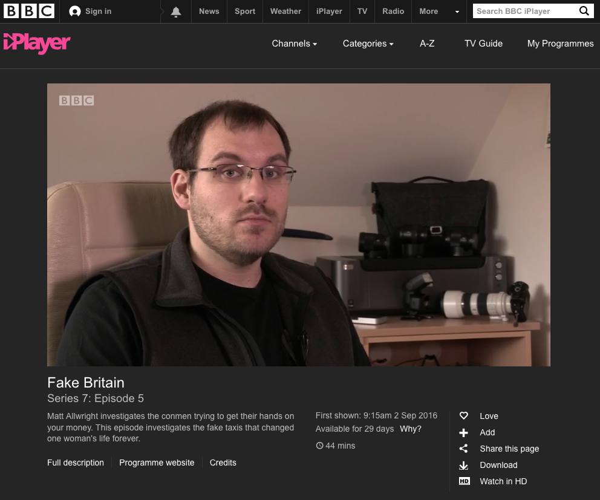
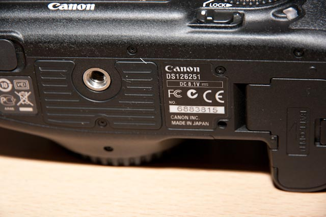
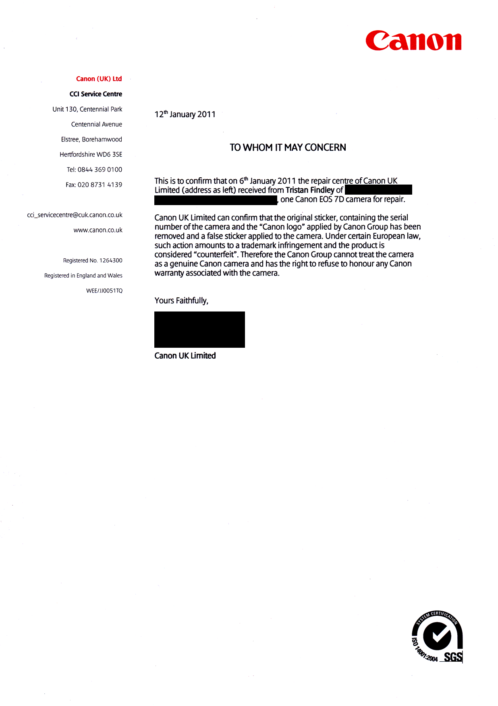

Back in February I saw a Facebook article from Amateur Photographer Magazine in conjunction with BBC's Fake Britain appealing for photographers who had inadvertently purchased fake camera gear to come forward and share their stories. Having been burnt once while buying a Canon 7D, I thought i would share my story with the hope that it might appear as a footnote in some article, and quickly forgot about it. A couple of weeks later i was contacted by Chris Cheesman of Amateur Photographer Magazine asking for a telephone interview about my story. After a nice chat and subsequently sending over some associated documents, Chris published '[Risks of buying fake cameras exposed by AP/BBC poll](http://www.amateurphotographer.co.uk/latest/photo-news/risks-of-buying-fake-cameras-exposed-by-apbbc-poll-72300#U2K0KFbSGQ4me7HM.99)'. It was kind of a big deal for me, not because it was about me, but because my story could serve as a warning to others looking to save a bit of money by going for the cheapest online deal.

Soon after the article published, I was contacted again by Chris thanking me for my contribution and asking if he could pass my information on to the Producer of Fake Britain for the BBC, Dom Carveley of [Screen Channel](http://www.screenchannel.co.uk). We made contact and a filming date arranged for March where he could film me at my home address in Farnborough. On the morning of March 29th 2016 Dom arrived and we set up in my office to film the interview portion of the segment. Once the interview was concluded we headed to an outdoors location near Windlesham, Surrey to film the B-Roll footage of me out doing some photography.

At 09:15 of  September 2nd 2016, [Season 7 Episode 5 of BBC's Fake Britain](http://bbc.in/2bXWDY6) aired.

My reaction to the piece was positive, as was the reaction of my friends and family, however they had questions about what had happened. I decided that I should write my story to provide some perspective as well as some background and the name of this particular company I had sourced my Canon 7D from.

I'm not a vindictive man, and I don't particularly like 'naming and shaming', however the recent coverage through Fake Britain give me an opportunity to raise awareness of what happened. I don't do this to target the company I purchased the camera from (however as you'll see this is now a moot point), but I do so to serve as a warning so others don't fall into the same trap I did.<!--more-->

# The full story - my fake Canon 7D

Back in 2010 I was looking to upgrade my Canon 40D to something a little more capable, and as I was big into wildlife photography I wanted a camera that would keep up with what I was shooting. I quickly narrowed down my choice to the Canon 7D and began the shopping process. Being a tech-savvy kind of guy, I deecided to go online for the best deal, and it wasnt long until I came upon a website of a company I'd not heard about before called 'Simply Electronics'. Not being as worldly-wise as I am today I thought I had found a bargain - the Canon 7D for a whole £100 less than what the next cheapest online price was. Perfect!

So on April 24th 2010 I purchased the Canon 7D with 15-85mm f/3.5-5.6 IS USM Kit.

The camera arrived and I was over the moon. It performed flawlessly and produced some amazing photos. I subsequently sold my Canon 40D to recoup some of my losses, reinvesting the money in a Canon 70-200 f/2.8 L IS II USM and eventually a Canon 400mm f/2.8 L IS USM lens, both purchased from Simply Electronics.

With 2011 on the horizon, I was presented with an opportunity to visit Grand Teton's National Park during February 2011. This is the winter season for Grand Teton's, with temperatures frequently below -30degC. The Canon 7D should (just about) be fine, but just to be sure I decided I would send it in to Canon for a service, cleaning and general health check. The camera went in the first week of January, and a short time later I received a phone call from Canon stating that the serial number on my camera didn't match anything in their records, and in fact they did not manufacture a camera with a seven digit serial number... They explained to me that the label on the bottom of my 7D had been tampered with and replaced. In fact the serial number on it didn't even match the serial number provided by the camera's EXIF data. Canon stated that from their perspective the camera was classed as 'Counterfeit' and not eligible for warranty. I asked Canon to ship me back the camera and I immediately contacted Simply Electronics.

- **Serial Number from bottom of the camera:** 6883815
- **Serial Number from EXIF data:** 530504812

[ Counterfeit 7D - the bottom label which had been tampered with (replaced)

Once I had reported all of this to Simply Electronics, they immediately flat out denied selling anything that is Counterfeit, and seemed slightly miffed that I had sent it back to Canon when they could have dealt with any warranty repairs. The email exchange continued with Simply Electronics continuously stated that they;

> 'do not sell counterfeit items, and the serial numbers provided are due to our items being sourced globally with UK specifications'

This argument would suggest that all products sold are genuine and all serial numbers are original, however they may not be UK serial numbers. I accept that could be the case, however it did not explain two things:

1. The Serial number on the bottom of the 7D being only 7 digits -  Canon stating clearly stated to me that they do not manufacture cameras with 7 digit serial numbers anywhere in the world.
2. The Serial number on the bottom and the Serial number in the EXIF differing.

Canon Affidavit - redacted

As Simply Electronics were refusing to budge, I sought advice from Canon and asked them to provide me with an affidavit stating that the camera had been tampered with and was classed as Counterfeit.

Even with the signed affidavit in hand I had to threaten Simply Electronics with court action should a refund not be provided, and eventually they gave in, organizing a collection for the camera and eventually a full refund. The whole process took over a month, but eventually I did get my money back.

## Who are (were) Simply Electronics?

Put simply (no pun intended) they sell cameras and other electronic devices. on the surface the company seems genuine enough, but if you dig deeper you'll find the truth hidden within the fine print in their site.

They do indeed have a UK address, though it is located on the Isle of Wight, making drop-in visits all-but impossible without some serious logistics and planning on your park. Digging further into their terms of service, you discover they have an address in Hong Kong.

**UK address:** The Innovation Centre, St Cross Business Park, Monks Brook, Newport, Isle of Wight, PO30 5WB **Hong Kong address:** 418 Kwun Tong Rd, Hong Kong

As of August 2016, Simply Electronics are no longer accepting payments, and have the following information on their website:

> We regret to inform you that we are no longer processing orders. If you have any transactional enquiries for an existing order that has not been delivered, please contact your card issuer to file for a chargeback.
> 
> Under these unfortunate circumstances, you are very likely be protected by your card issuer to apply a claim against the order for the full value. We apologise for any inconvenience caused.

Reading the latest [Trust Pilot reviews](https://uk.trustpilot.com/review/www.simplyelectronics.net), it looks like Simply Electronics have gone into liquidation. A number of angry patrons have posted their frustrations, and I can only hope that the relevant credit card companies can retrieve some of their lost money.

## Counterfeit or Grey Import?

A 'grey import' is the term given to a product that was destined to be sold in another country but instead has been sold in the UK. Usually these products are indistinguishable from the UK product, with the only usual exception being the provided power cable. Unfortunately Grey Import goods generally have warranty restrictions meaning they would not be supported or services by the manufacturer.

Counterfeit in this instance was the term Canon gave to a camera that had a tampered serial number. In my instance the sticker on the bottom of the camera had been replaced with a fake.

Truth be told, my camera was a grey import, though at the time this wasn't known to poor inexperienced me, so even if the sticker hadn't been tampered with, Canon would probably still have refused to undertake any warranty work on it.

## Spotting and avoiding the Grey Import

The best way to identify companies that provide Grey Import goods is to read their website's small print. This is normally located on their 'About Us' or 'Terms of Service' page. Ideally make sure they have a UK phone number that operates between 0900 and 1700 (or something like that), instead of something that seems to be on another time zone (its easy enough to get a UK phone number even if you're not located in the UK).  If you're still concerned try searching for their address on Google Maps. Thanks to Street View you're now able to see if they're located in some residential house or on a business park.

Another good way to spot a grey import is through the warranty provided by the online store you're buying from. If it seems they want you to avoid returning the product to the manufacturer and instead want it returned to them or a third party for repair. This will normally be easy to find on their 'Returns' or 'Repairs' page.

So should you avoid purchasing Grey Imports all together? No not necessarily. There are some stores based out of  Hong Kong that actually offer a very good service. The one that springs to mind for me would be Digital Rev. They're not shy about the fact they are based out of Hong Kong, and even state that any warranty repairs go through them. Their prices are of course pretty good, and my own purchasing experience through them was very good.

Additionally some products might be offered with a Global Warranty. This is fairly rare now, and unless you purchase an extended warranty plan from the manufacturer, it is unlikely to be global. One example I have of this is my Apple Watch which was purchased for me by my girlfriend from Amazon.co.uk, but through a third party reseller. The saving was enough for her to justify getting me a rather extravagant Christmas and Birthday present. Of course me being me I went out and purchased an extended warranty, only to be told by Apple that it wasn't a UK model. Thankfully the act of purchasing the Extended Warranty made the warranty global, however the highstreet Apple Store was unable to help with the purchase, and instead had to direct me to their telephone service to purchase it.

## Links

- [BBC's Fake Britain, Season 7 Episode 5](http://bbc.in/2bXWDY6) on BBC iPlayer
- [Risks of buying fake cameras exposed by AP/BBC poll](http://www.amateurphotographer.co.uk/latest/photo-news/risks-of-buying-fake-cameras-exposed-by-apbbc-poll-72300#U2K0KFbSGQ4me7HM.99) by Chris Cheesman of [Amateur Photographer Magazine](http://www.amateurphotographer.co.uk/)
- [I Bought a Fake Nikon DSLR: My Experience with Gray Market Imports](https://petapixel.com/2015/08/14/i-bought-a-fake-nikon-dslr-my-experience-with-gray-market-imports/) by Craig Skinner of [PetaPixel](https://petapixel.com/)
- [Trust Pilot - Simply Electronics](https://uk.trustpilot.com/review/www.simplyelectronics.net)

## The email trail

Below is the full unabridged, unedited email trail from Simply Electronics in chronological order. Surnames have been removed, as have any personal or banking details.

I post this not as an attack on Simply Electronics, but as a factual statement of what happened. It is a bit long, but it might be of some interest.

---

- **Date:** January 6th 2011
- **From:** Tristan
- **To:** Simply Electronics

To whom it may concern

Today I attempted to send my Canon 7D in to Canon's UK Service Centre for repair / service. Canon informed me that the camera is in fact a counterfeit unit. The serial label on the bottom of the camera has been tampered with and replaced with a fake one, with a fake serial number and fake information. Indeed the EXIF data from the photos produced and the serial number on the bottom of the camera do not match up. These serial numbers are reported above. Canon will not support the unit as it is classed as counterfeit, and informed me to seek a full refund from the supplier. To this end, I am emailing you to request that a refund is processed ASAP so that I may source a replacement camera body ASAP. 

I am sending a CC to Lauren of Canon UK, who noticed the counterfeit unit, and she will be able to confirm that this unit is indeed not an original Canon unit. She has also kindly offered to send pictures of a fake and genuine Canon label for verification. 

Due to the legal nature of this case, I would request that Simply Electronics process a refund to me for the total purchase amount of the above referenced order. Once the refund has been received, I will re-box the camera and return it to Simply Electronics so that they may follow up any legal action they may wish to take with their suppliers. I am not happy to release the camera until a refund has been processed as the camera is the proof that would be required if any further action of a legal nature might be taken in the event of no refund. 

Lauren will be able to provide photos of counterfeit labels, and I am able to provide photos of the Canon 7D body once it is back with me later today / tomorrow.

I look forward to your speedy reply.

---

- **Date:** January 7th 2011
- **From:** Simply Electronics
- **To:** Tristan

Dear Tristan,

Thank you for your email. We sincerely apologise for the inconveniences. 

Do rest assure that we have received your request and we are handling it accordingly according to your email that was sent to us. 

I would like to also assure you that we only sell genuine Canon items, however they are sourced globally to offer the best prices to our customers. In addition all products from Simply Electronics come with a 12 month warranty from receipt of the purchase and are covered by Simply Electronics After Care facilities.  We would be able to assist you if you are facing some technical issues with the product.     

If you have any other questions or concerns, please let us know and we will be happy to assist you further, and kindly do send us the photographs once available so we could further look into this matter. 

Best Regards,

Donald Customer Service Executive

---

- **Date:** January 7th, 2011
- **From:** Tristan
- **To:** Simply Electronics

Donald

I'm afraid that support of the item is not under dispute here. The product (according to Canon) is counterfeit. Canon instructed me to seek a full refund for the unit, as are Trading Standards UK. 

Canon are currently in discussion with their Legal department to get written confirmation about the fraudulent nature of the product. I myself can prove that the unit I received was indeed tampered with prior to me receiving it.

Attached is a photo of the bottom of the 7D with the fraudulent label exposed, and another picture sent to me from Canon of a genuine 7D label (Supplied by Lauren of Canon (CC'd) - The last four digits of which have been scrubbed). The label on my 7D has been replaced prior to it being shipped to me. Canon brand this as counterfeit. Canon do not manufacture cameras with only 7 digit serial numbers. Their UK support centre has confirmed this.

After discussion with Trading Standards UK, I was informed that I could demand a refund under the Consumer Credit Act 1974, Section 75. This is what I wish to do. As the product has been deemed counterfeit by Canon, I did not receive what I payed for.

I have CC'd in Lauren of Canon who was the support representative who identified the fraudulent product. 

Once a refund is received, I will be happy to return the camera (boxed, with all packaging, invoices, and paperwork) to Simply so you may dispute this with your supplier and seek a refund for them under whichever law covers you.

If there are any problems with this, please ring me on 07883 443 602, or email myself (CCing in Lauren from Canon)

Regards

Tristan

---

- **Date:** January 7th 2011
- **From:** Simply Electronics
- **To:** Tristan

Dear Tristan Findley,

Thank you for your email.

Most of our stock does come from the UK, and some do from other countries; all of which are made for UK market. 

Further to our earlier email, I would like to assure you that all our Canon products are genuine and  come with UK Specification with 3 pin power plug and a English Manual. If you do encounter any manufacturer defect with your purchase within  a year from purchase we will be able to assist you with warranty repairs.   

We do hope that this helps clarify any doubts. Meanwhile, please do not hesitate to contact us should you require further assistance.

Thank you.

Best Regards,

Donald Customer Service Executive

---

- **Date:** January 7th, 2011
- **From:** Tristan
- **To:** Simply Electronics

So, are you saying that Canon (the manufacturers of the camera) are wrong in saying that it is counterfeit? 

I think they would know the best seeing as they're the manufacturer and they know their own products.

Canon do not manufacture bodies with 7 digit serial numbers. Care to explain any of these points?

---

- **Date:** January 12th 2011
- **From:** Simply Electronics
- **To:** Tristan

Dear Tristan,

Thank you for your email.

We do understand that this issue was brought up with Canon UK,  but however Canon is an international company based in Japan, and do have manufacturing plants located in Asia. 

This could be similar to Apple products from the United States, but the manufacturing plant is in China. The serial numbers for the Apple products especially the I phones have different serial numbers for different countries. As mentioned from our previous email that we do source our items globally with genuine products.

Please also note that the item was bought during April 2010 which is approximately nine months. Under this circumstances I am afraid that we are unable to offer you a replacement referring to our terms and conditions policy.  

Should you have any further queries to this matter, please feel free to contact us. 

Best Regards,

Donald Customer Service Executive

---

- **Date:** January 12th, 2011
- **From:** Tristan
- **To:** Simply Electronics

I have already discussed this issue with Canon UK. They inform me that they do not manufacture products with this serial number (only seven digits) anywhere in the world. Canon uk service centre are well aware of their international products, as they do not manufacturer products in the UK. I did ask this question when the issue was raised.

I am afraid that Simply Electronics are guilty of supplying me with a counterfeit product. Whether or not this was intentional or not, is irrelevant. The fact is that any electrical product sold in the UK is covered for 1 year by the supplier. You are such, and the issue is that the product is counterfeit. This has been proven by Canon  (a multinational corporation who I dare say have a better understanding of their own products than Simply Electronics do)

I have asked two very simple questions, which time and again you have refused to answer to any satisfaction

1) if the Product is not counterfeit, then why do Canon identify it as such?

2) even if the product is not counterfeit and Canon are wrong, why does the EXIF data serial number from the body (obtained digitally and easily verifiable)  not match the serial number printed on the underside of the body?

You have also failed to comment on the quite obvious differences with the label on the bottom of the camera body. Not only this, but I would like an explanation why a recent examination of the original box yields no body number label. When Canon products are boxed (by Canon) for shipping, the boxes have the body label applied to them.

Unless a resolution is reached very shortly, then I will be forced to take matters further.

Regards

Tristan 

---

- **Date:** January 13th 2011
- **From:** Simply Electronics
- **To:** Tristan

Dear Tristan,

In regards to your concerns we would like to inform you as per previous email that we do not sell counterfeit items, and the serial numbers provided are due to our items being sourced globally with UK specifications.  

Simply Electronics is an international company that are fully aware of their products being sold to our customers with a global sales and marketing team.  I would also like to mention that all products from Simply Electronics come with a 12 month warranty from receipt of the purchase and are covered by Simply Electronics After Care facilities.  By placing an order it is assumed that this has been acknowledged by the client and taken into consideration.

Please also note from our previous email sent to you that we are unable to assist you with a replacement or refund due to our terms and conditions since the duration time is around nine months. 

A quick solution to this problem would be is to have the product sent to us for repairs, so we could put your mind at ease. 

Do not hesitate to contact us for further queries. 

Best Regards,

Donald Customer Service Executive

---

- **Date:** January 13th, 2011
- **From:** Tristan
- **To:** Simply Electronics

Again, you have failed to answer the two questions that I have asked.

In response to your statement that Simply Electronics does not sell counterfeit goods. I will acknowledge that knowingly, this may be the case, however in this instance, one has slipped the net. I quote a recent email received from Canon, in which I asked whether or not the serial could be from an international unit.

"Tristan, 

Thank you for your e-mail. 

I appreciate your query. Please be advised that the label is confirmed counterfeit by the Intellectual Property division of Canon Europe. Indeed there is no way that this label could be representing a foreign unit, the serial number will always be 10 digits long, although different digits do enable us to identify which continent the unit was intended for sale in. However, as they are all produced in Japan, they all look the same. "

I also have a signed letter from Canon Europe stating that the item is counterfeit and why they deem it as such. 

I am afraid that I am fast running out of patients with this. If a satisfactory result is not received, then I will pursue other courses of action, one of which may be court action against Simply Electronics. Now that I have signed affidavit from Canon, I will be well within my rights and abilities to do so.

Kind regards

Tristan

---

- **Date:** January 14th 2011
- **From:** Simply Electronics
- **To:** Tristan

Dear Tristan,

Thank you for your email.

We apologise if the previous message did not answer your concerns. However, please be noted that we are already investigating this issue and we require information. Therefore, may we kindly ask for an original  pic file taken with the camera as well as the EXIF data providing the serial number. Also, may we kindly request for a copy of the signed affidavit from Canon stating that the item is a counterfeit.

We greatly appreciate your kind understanding and patience regarding this matter.

Looking forward to your response.

Best Regards,

Francis Customer Service Executive

---

- **Date:** January 15th, 2011
- **From:** Tristan
- **To:** Simply Electronics

Francis

Please find attached a photograph taken with the Canon 7D (JPEG (Small)), shot without a lens so no lens data can be incorporated into the EXIF data. Also find attached a picture of the fake label (serial number 6883815) and an original label on a 7D provided by Canon for reference (please note that this is only 6 of 10 digits as the last 4 were removed for security reasons by Canon - starting 028010).

The signed letter from Canon can be viewed at : <link redacted>. 

I can also attach pictures of the original packaging, which do not include the body number on the box, as regularly purchased bodies do. This can be verified by Canon, and by myself with a photograph of other Canon camera packaging.

I hope this information is helpful in your investigation

Regards

Tristan 

---

- **Date:** January 19th, 2011
- **From:** Tristan
- **To:** Simply Electronics

I apologise for any confusion I may have caused. I forgot to attach the sample photo in the last email. Please find it attached in this email. it is a JPEG (Small), taken by the Canon 7D. There was no lens attached at the time so no lens data could be appended to the camera EXIF data.

Please keep me informed with your investigation. I am happy to provide any more details that you might require.

Regards

---

- **Date:** January 25th, 2011
- **From:** Tristan
- **To:** Simply Electronics

Francis

What is the status of the investigation into this issue? You have had six days to analyse the photo and the data provided by myself and Canon.

Please get in touch to advise asap.

Regards

Tristan

---

- **Date:** Unknown Date, 2011
- **From:** Simply Electronics
- **To:** Tristan

Dear Tristan,

Thank you for your email.

We are currently awaiting an update from the relevant department, and will get back to you as soon as possible with the status.

We apologise for any inconvenience caused.

Best Regards, Donald Customer Service Executive

---

- **Date:** January 26th 2011
- **From:** Simply Electronics
- **To:** Tristan

Dear Tristan,

Greetings from SimplyElectronics.

With regards to your concern, please be informed that the photo you have provided is being used as the initial evidence for the investigation. Please be noted that the investigation is still on going between SimplyElectronics and our supplier. 

To recap, as per our email on 18 January, we would like to arrange collection for the product and offer a full refund. In any case, may we kindly confirm if you are willing to accept the offer to resolve this issue between you and SimplyElectronics.

Looking forward to your response.

Best Regards,

Francis Customer Service Executive

---

- **Date:** January 26th, 2011
- **From:** Tristan
- **To:** Simply Electronics

Francis

I am happy to arrange for a collection and refund, however it needs to be completed (inc. refund) before Feb 1st as I am due to depart for the United States for three weeks. This would mean an urgent collection date if it is to make it back to you this week.

Before I go ahead with any of this, I would like to request that the agreement is put in writing on headed paper, signed by either yourself or another manager / senior manager with permission to authorise the collection and refund. This has been advised to me by both Canon and a legal council. 

This would need to include the amount to be refunded (the entire invoice from the purchase of the Canon 7D, including the 3year MACK warranty that was supplied with the camera (this will be included in the box when returned - it has been registered with them though, and I am happy to provide the registration confirmation email with the counterfeit serial number to confirm registration). Also required will be details of the pickup / return agreement, and I would highly recommend detailing the pickup address, return address, and the courier used (this is for both our protection, as neither of us can then claim that the item was not shipped or shipped to the wrong address etc). 

Upon collection, I would expect a receipt from the courier along with a reference / tracking number so that the pickup can be confirmed by both parties.

I hope these conditions meet with your approval and expectation. please be assured that I am trying to make everything legally water-tight for both parties, so that neither can claim foul play.

I have been recommended to ask for compensation with regard to this case, as I had purchased other accessories for this camera such as the battery grip, lens hood (for the 15-85mm), and lens filters (for the 15-85mm). In addition I have also had to pay out for a new camera body, as my trip to the US on Feb 1st has been specifically for photography purposes, requiring the camera that is due to be returned (hence why it went to Canon for a service). The trip was obviously a significant outlay, as was the camera 8 months ago. Obviously without the camera, the trip would have been impossible. I am attaching a press-release of the trip, and other details can be found on my website link: [http://www.alopexproductions.co.uk/index.php/2011/01/01/402/](http://www.alopexproductions.co.uk/index.php/2011/01/01/402/) . As you can see, this is a major trip, and it has interested parties including newspapers, magazines, wolf trusts, and National Geographic. 

I leave the ball in your court, but would be grateful if you would consider the above when handling the case.

Best regards

Tristan

---

- **Date:** January 27th 2011
- **From:** Simply Electronics
- **To:** Tristan

Dear Tristan,

Thank you for your email. 

Please be advised that you may use our email correspondence as a proof of the item authorized to be returned to us for your refund. Also, please be advised that should we arrange pick up, we cannot confirm to you at this time as to when the item will be collected or by whom as this will be arranged by a different department.  

If it is alright to proceed with collection, please provide us with the following information so we can arrange for a courier to pick up the parcel:

Contact Person: Contact Number: Pick Up Address:

However if you choose to be able to trace your parcel on your end, you may have the item returned to us, however, we will not be liable with the return postage. If you choose to have this returned under your expense, please note our returns address as follows:

Simply Electronics Ltd The Innovation Centre St Cross Business Park Monks Brook Newport Isle of Wight PO30 5WB

Please ensure that a copy of the RMA form is attached to the returned parcel. In case, to locate the RMA form, log into your SimplyElectronics account, and the "RMA Forms" link can be found down the left and column of the webpage under the "My Account" box.

Please confirm how you would like to proceed in this regard.

Best Regards,

Zoe Customer Service Executive

---

Please could you arrange pickup for the following details

Contact Person: <redacted> Contact Number: <redacted> Pick Up Address: <redacted>

If you could please respond to the questions in the previous email regarding compensation etc, i would be grateful.

Please understand that this return is under hte condition that it is for a Full refund for the total amount as detailed on the invoice from Google order number: <redacted> dated **24 April 2010**, with a total cost of **£1549.90**. With regard to the refund, I would expect the refund no less than 7 days after receipt of goods.

The items will be boxed for return to yourselves at the address detailed in your previous email. 

Details from the courier company will be required, including a receipt of collection. If there are problems with anything of this, then please contact me. I will take the arrangement of a courier / generation of the RMA as acceptance of this.

I will include a printed version of the affidavit from Canon with the goods.

Regards

Tristan

---

- **Date:** February 7th, 2011

Parcel collected by DPD, consignment number 12 24 448288.

---

- **Date:** February 10th 2011
- **From:** Simply Electronics
- **To:** Tristan

Dear Tristan,

Greetings from SimplyElectronics.

We are writing to inform you that we received the item. Please note that a refund is being processed for the returned item.

Should you have further queries, feel free to contact us again.End MessageBodyImage

Best Regards,

Kelly Returns Service Executive

---

- **Date:** February 10th, 2011
- **From:** Tristan
- **To:** Simply Electronics

Thank you for sorting this out.

Please can the refund be processed straight to a bank account. The credit card used for this transaction no longer works as it was reported as stolen less than a year ago, and subsequently closed. 

Please send the refund to my account, which is the following:

<bank details redacted>

Thanks and best regards

Tristan

---

14th February 2011 - Tristan > Simply Electronics

Would you please update me on the progress of this case? 

Best regards

Tristan

---

- **Date:** February 15th 2011
- **From:** Simply Electronics
- **To:** Tristan

Dear Tristan,

Thank you for your email.

We would like to inform you that we have contacted our accounting department again for the refund of the item and rest assured that once this has been initiated, a notification email shall be sent to you.

We seek your kind understanding for this matter.

Meanwhile, should you have further queries, please feel free to email us again.

Best Regards,

Kelly Returns Service Executive

---

- **Date:** February 18th, 2011
- **From:** Tristan
- **To:** Simply Electronics

Kelly

With regard to this refund: I have yet to receive anything from Simply with regard to a refund being processed.

Please note that under the terms of the product return, you had 7 days to provide a refund from date of receipt of the product at your UK delivery address.

Please could you chase and expedite this refund.

Regards

Tristan

---

- **Date:** February 21st 2011
- **From:** Simply Electronics
- **To:** Tristan

Dear Tristan,

Thank you for contacting us and we are sorry to hear that you have not yet received your refund.

I can perfectly understand your frustration towards this issue.

Please be advised that I have again contacted the relevant department to complete your refund as soon  as possible given it is long been overdue.

Failing to receive a refund confirmation after few more working days, please immediately contact us again and we will be more than happy to follow this for you.

Once again, I would like to extend our sincere apologies for not meeting your service expectations and again, I would like to seek your extended patience on this matter.

Best Regards,

Elyce Customer Service Executive

---

- **Date:** February 24th, 2011
- **From:** Tristan
- **To:** Simply Electronics

Elyce

It has again been a few days, and again I have not received anything from Simply regarding this matter... Please would you make the finance department aware that this breaches the previous terms laid down by myself with regard to this matter, which Simply agreed on when collecting the product. I would request a direct number for the finance department so that I may contact them directly.

 If they wish to contact me directly, please ask them to contact me on +44 (0)7883443602

Regards

Tristan

---

- **Date:** February 24th 2011
- **From:** Simply Electronics
- **To:** Tristan

Dear Tristan,

Thank you for your email.

Please be advised that your refund is still being processed. However, rest assured that we will have your case followed up. 

As soon as your refund has been completely processed, an email notification will be sent to you to confirm this. Please note that this may take 3 more working days.

Meanwhile, should you need further assistance, please feel free to email us again.

Best Regards, 

Chester Customer Service Executive

---

- **Date:** February 25th, 2011

Refund of £1,549.90 received via Google Checkout.
