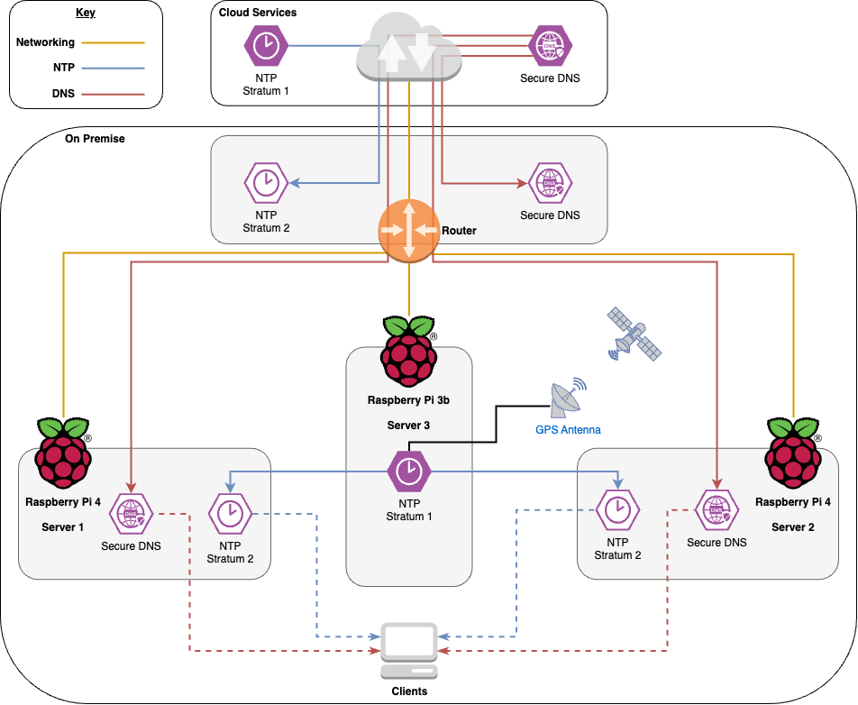

So it's rare that I have an outage in my home infrastructure that becomes a perfect storm, but this was an interesting edge-case that I had never thought of, and one worth talking about.

## Background - infrastructure and services



In my home infrastructure I run a pair of servers that provide DNS and NTP services to my network. These are both Raspberry Pi 4 SBCs (Single Board Computers), which we'll refer to as Server 1 and Server 2. I have another Raspberry Pi 3B+ SBC with a GPS hat which is my dedicated Stratum 1 timeserver. We'll refer to this as Server 3.

### DNS

Server 1 and Server 2 provide DNS to my network, with DoT (DNS over TLS) and DoH (DNS over HTTPS) sources set as upstream. This ensures all my DNS traffic from outside of my network is encrypted in transit, and thus not visible to the ISP. Downstream; these servers provde DoT, DoH as well as regular DNS service. Of course DoT and DoH require certificates, so both of these servers have regularly renewing LetsEncrypt certificates, so are certificates thare are recognised by internal clients without the need to distribute an internal certificate chain. This certificate requirement and configuration will become important later.

### NTP

Server 3 is a Raspberry Pi 3B+ with a GPS Hat. This provides accurate GPS time (and not the position of the house in case I loose it... I'm really not that stupid). This is served across the network using Chrony, and gives me a Stratum 1 timesource.

Both Server 1 and Server 2 run Chrony, pointing to Server 3. This gives me two Stratum 2 timeservers, from which all other clients can accurately set their clocks.

### Network

The only other thing of note in the infratrucutre is that the router (a Ubiquiti router), is configured with the same upstream DNS as Server 1 and Server 2. NTP on this is tied into a cloud-based Stratum 1 server in Canada, [Torix](https://www.torix.ca/community-projects/). This is another fact that will come up later.

## The incident

Sometime in January, there was a power outage for longer than 4 hours, which of course shut down the entire infrastructure. Nothing too serious - these things happen. I recieved a notification from Ubiquiti that the router had gone offline. No problem, other than no power and no internet.

But when the power was restored, services did not come back online as expected.

### Symptoms

The first indiciation that something was not right was when dlients would not communicate with anything using DNS names. But this was strange; the Ubiquiti kit had reported to me that internet was restored. A quick check of the control panel confirmed that internet was restored and working as expected.

Testing with the clients confirmed that DNS was affected. Outbound connectivity was working as expected (direct connection via IP), so internet itself was fine. This pointed to the two DNS servers.

Investigating these was a little harder, as they are both run headless. What was stranger, was that I was unable to SSH into them via their internal DNS names. This meant that internal DNS was also affected, but I was unsure why. After SSHing directly to their IPs, I confirmed that the DNS services on both Server 1 and Server 2 had failed to start, but this was due to a weird cause - the certificates were no longer valid. Okay, I thought, somehow the power outage has occoured at exactly the time when the certificates were due to expire and be renewed. But that shouldn't be a thing, as the certificates are supposed to renew 1 month ahead of their expiration times. This of course made me doubt the code I had written to renew my internal certificates from LetsEncrypt was working as expected, but first I thought I would investigate the certificates the DNS service was using to provide DoT and DoH services internally. 

Querying these internal certificates confirmed they were in fact valid. Stranger and stranger... So I have valid certificates but they're reporting as invalid. I then ran a validation on the certificates using OpenSSL, and a weird error popped up. Certificates were not *yet* valid... Ah hah! the smoking gun!. A quick timedatectl later, and it transpired that Server 1 and Server 2 thought they were many years in the past.

### The cause

A bit of background. SBC's like the Raspberry Pi series (before series 5) do not have internal clocks (nor onboard batteries). This means that when they first boot they connect to the internet to retrieve the time and set their RTC (Real Time Clock). Something had happend to cause Server 1 and Server 2 to fail seting their RTC.

Further investigation identified a boot failure on Server 3. This had prevented NTP services from coming up, and thusly meant there was no NTP to set the time on Server 1 and Server 2. Due to a (possibly) stupid configuration on my part, Server 1 and Server 2 had been set to only use Server 3 as their NTP source - no alternative internal NTP or external NTP source, and for DNS both servers had been set to use themselves as their upstream DNS server, so effectively had no upstream DNS with which to set any extenral NTP server, even if I had configured it. As the servers had no time and had reset their clocks back to the start of EPOC time, the certificates I had generated through LetsEncrypt were indeed not yet valid.

### The fix

This is probably the most boring part of the story. The NTP server had not failed, but had gotten stuck on boot. Writing this article after the fact, I forget what had caused this, but a power cycle later and Server 3 came back online. A reboot of server 1 and server 2 brought them back online as they were able to set their internal clocks again.

## Looking forward

Fixing this isnt overly complicated, but does require some thought about consistency.

### Fixing NTP

Server 1 and Server 2 should have an alternative server specified in their Chrony configuration. Setting these as an alternative server would not mean that it would nessecarily use it. As communication from Server 1/2 to Server 3 is measured in less than 100ms, and connectivity to Torix (my chosen Stratum 1 NTP) is measured in over ~3000ms, the internal server will always be preferred so long as it is online.

**Note:** Identifiable information (i.e: internal IP addresses or secrets) has been obvescated.

```conf
server  192.168.1.13     iburst key 01 prefer
pool    ntp.torix.ca     iburst
```

```plaintext
$ chronyc sources
MS Name/IP address         Stratum Poll Reach LastRx Last sample
===============================================================================
^* 192.168.1.13                  1   9   377   440  +7478ns[  +10us] +/-  287us
^? ntp3.torix.ca                 1  10   173   473  -5769us[-5766us] +/-   49ms
^? ntp2.torix.ca                 1  10   253    37  -3955us[-3955us] +/-   48ms
^? ntp1.torix.ca                 1  10   333   393  -3458us[-3458us] +/-   47ms
```

Server 3's NTP is also now configured to use Torix as it's upstream NTP server, but using a split configuration.

```conf
refclock PPS /dev/pps0 lock NMEA trust prefer
refclock SHM 0 refid NMEA trust noselect

#Backup TORIX pool
pool    ntp.torix.ca    iburst

# Backup TORIX pool without requiring DNS
server  206.108.0.131   iburst
server  206.108.0.132   iburst
server  206.108.0.133   iburst
```

This gives us the following result:

```plaintext
$ chronyc sources
MS Name/IP address         Stratum Poll Reach LastRx Last sample
===============================================================================
#* PPS0                          0   4     7    12    +73ns[+4188us] +/-  249ns
#? NMEA                          0   4     7    11    +92ms[  +92ms] +/-  252us
^? ntp1.torix.ca                 1   6    17    43  -3661us[ -557us] +/-   47ms
^? ntp2.torix.ca                 1   6    17    43  -3786us[ +402us] +/-   48ms
^? ntp3.torix.ca                 1   6    17    43  -4167us[-1063us] +/-   48ms
```

### Fixing DNS

While there is no good way to fix this, if DNS on server 1 and server 2 are offline, I don't want stray DNS requests going out across plaintext. For now, I've opted not to alter the upstream (OS) DNS server for Server 1 or Server 2, instead keeping them relient on themselves.

## Legal

### AI Statement

In accordance with [My AI Policy](/legal/ai), AI was not used in the creation of this article.