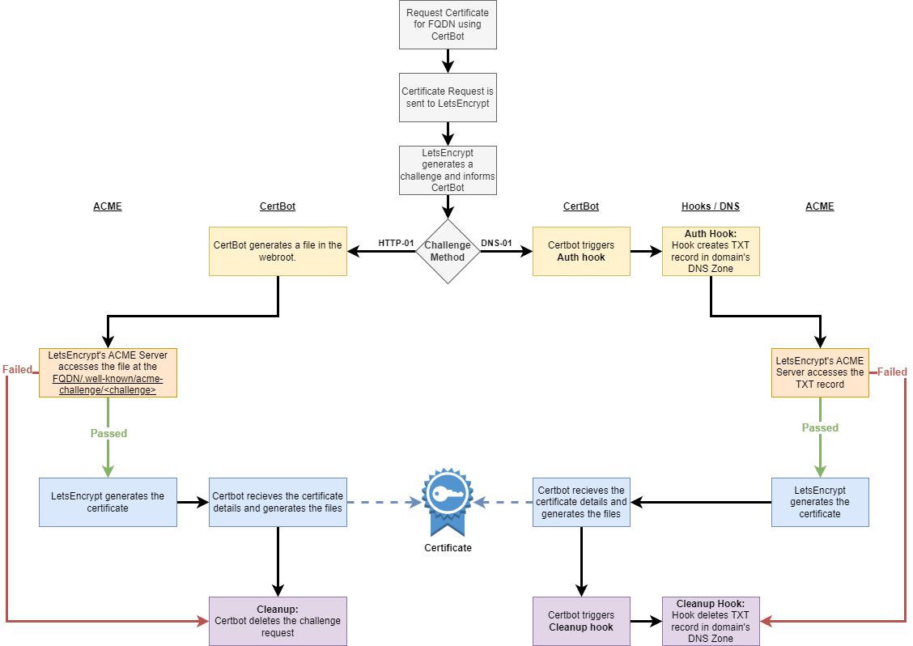
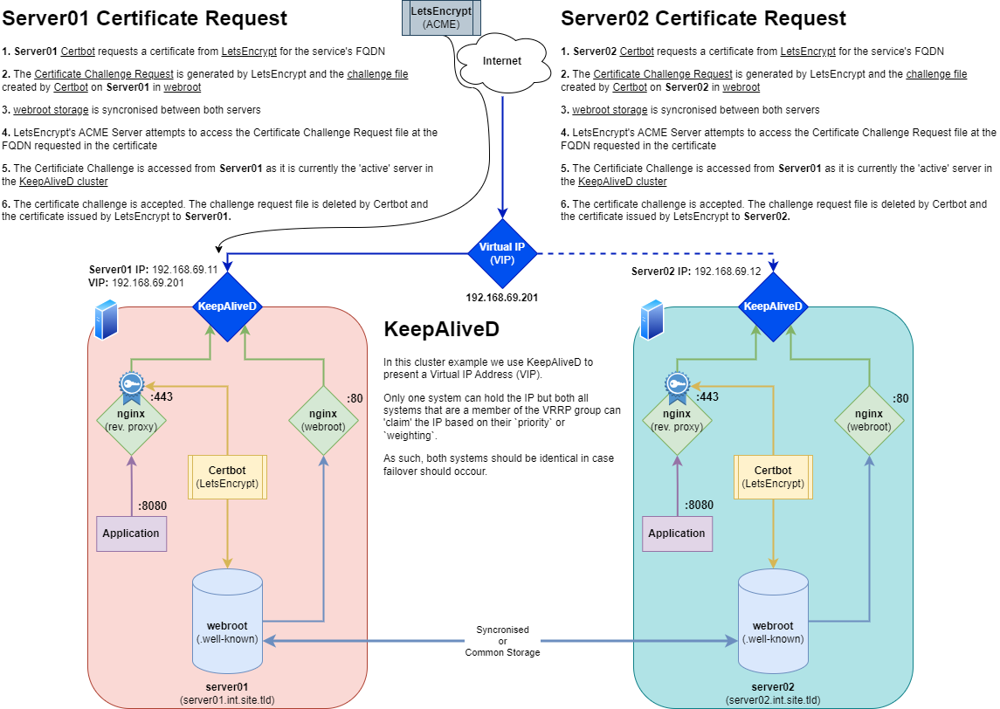

So you’ve built a rock-solid HA setup with two Linux servers, a VIP floating between them (thanks to Keepalived), and your favorite services humming along nicely. But then, the moment comes:

> “How do I get a Let's Encrypt certificate for this domain if only one server has the VIP at any given time?”

For those of you who are experienced with LetsEncrypt may know, when you request a certificate for a particular domain via the Certbot software, LetsEncrypt must validate your ownership of the domain you're requesting a certificate for. After all, you don't want just 'anyone' to be able to generate a certificate for your site, application or service.

Under the hood their are two basic methods for validating ownership of the domain (or possibly subdomain). DNS-01 or HTTP-01. We'll briefly explore the DNS-01 option as this can be a quicker solution *in some cases*. When those cases don't apply, HTTP validation becomes the path of least resistance — but with its own HA gotchas.

First, let's look at the common steps that ocour when requesting a certificate



---

## The DNS-01 Method (When It Works)

DNS-01 Validation works

DNS Validation shifts the solution purely to code, but requires certain capabilities of your DNS provider. 

While DNS validation exists (and is arguably more flexible), it isn’t always available due to provider limitations or internal complexity. 

DNS validation is a powerful option:

- Works regardless of which server has the VIP
- Can be automated via DNS provider APIs
- No need for a web server on port 80

However, it comes with some caveats:

- Requires API access to your DNS provider
- Needs automation hooks (custom scripts)
- Not all DNS providers are supported

[Check out my DNS-01 automation scripts to integrate with  Gandi LiveDNS ➜](https://github.com/tfindley/certbot)



---

## When You're Stuck With HTTP-01 Validation

Sometimes you're stuck using HTTP:

- Your DNS provider doesn’t support automation
- You’re using internal-only or split-horizon DNS
- You just want the simplest possible Certbot setup

Let’s explore how to do this safely in an HA setup.

---

For the following scenario, we're going to make a few assumptions, and ignore a few complexities that are outside of the scope of this document.

We'll assume that:

- You're hosting an application that requires a reverse proxy (probably for TLS reasons)
  - This solution will work perfectly fine for hosting web content in a non-containerised (traditional?) way. If you have mulitple web servers you likely have shared storage in place already
- You're using nginx as the reverse proxy of choice
  - this should work with 'any' reverse proxy solution. Just adapt the solution into your own implementation. For example, you could use *apache* or *caddy*.

Outside the scope of this document:

- **Networking** - we'll assume you know what an IP is
- **Routing** - we'll assume that you've already got port 80 and port 443 forwaded to a VIP and have tested this from the outside world
- **DNS** - We're going to assume you own a DNS Address, have it pointed to your external IP address, and have tested that you can resolve web content against that DNS Address
- **Security** - While this guide should work, I take no responsbility for the security of integrity of your setup or solution. Please try to derive your own solution rather than copy mine verbaitem.

It's also worth stating that if you're doing this, you're likely hosting a product or service that cannot or shouldn't be containerised. There are a number of alternatives that can handle this just as well in the containerisation world - i.e: Traefik.

On the subject of Traefik, it is worth mentioning that this will not work as a way to circumvent the need for an enterprise license of traefik to handle multi-node cert requests.

## How the HTTP-01 Challenge Works

Under the hood, LetsEncrypt creates a .well-known challenge responce in a directory called `acme-challenge`. This is a random string that it is provided upon request of a certificate to prove that you own the domain that you're requesting the certificate for.

For example, if we request a certificate for `service.domain.tld` then letsencrypt will perform the request. the ACME server will return a challenge string to LetsEncrypt which it will need to host at `http://your.domain.tld/.well-known/acme-challenge/<challenge_string>`. That text string will exist for the length of the challenge before it is deleted.

So the solution is simple, we need to somehow get the requests from both servers to be available at the virtual IP. To do this, we need to create a shared directory that 'both' servers can access and serve over nginx.

When you run Certbot with HTTP validation:

1. Certbot requests a challenge from Let’s Encrypt.
2. Let’s Encrypt gives you a token.
3. Certbot creates a file containing the token under:

```path
/.well-known/acme-challenge/<token>
```

4. Let’s Encrypt makes an HTTP request to:

```url
http://your.domain.tld/.well-known/acme-challenge/<challenge_string>
```

5. If it finds the right content there, you’re verified.

So we need to ensure that *whichever server has the VIP* is serving this challenge file correctly.

---

## The HA Problem with HTTP-01

In a Keepalived setup, only one server has the VIP at a time. Even if both are running Nginx, only the active node will receive traffic for the domain.

We need to make sure:

- Both servers have the challenge files from both servers available
- Only one server responds to HTTP requests
- Both servers recieve their respective certificates

---

## Solution: Share the Webroot

So we can create a fairly simple and scalable solution for this. We create a webroot to store/handle the `.well-known/acme-challenge` files and share it between all servers that can host the application / web content.

Let's break the proecss down using a diagram



We'll use `/usr/share/nginx/letsencrypt` for this. Ensure this directory exists on both servers and that this is either a shared network path, or that the directory is syncronised. We'll discuss methods of sharing the webroot in the [next section](#shared-filesystem-options).

Now create your nginx configuration in `/etc/nginx/conf.d/acme.conf`

```conf
# HTTP - Serve .well-known/acme-challenge and redirect other traffic to HTTPS
server {
    listen 80;
    server_name service.domain.tld;

    # Serve Let's Encrypt ACME challenge requests
    location /.well-known/acme-challenge/ {
        root /usr/share/nginx/letsencrypt;
    }

    # Redirect all other HTTP traffic to HTTPS (port 443)
    location / {
        return 301 https://$host$request_uri;
    }
}
```

Now to generate a certificate request that will store its verification in the directory we've just created. We’ll use the `--webroot` method of Certbot, and with all servers sharing a common webroot directory, challenges from each webserver in the cluster will be stored in a common directory and served by the active server.

Run the following Certbot command to test:

```bash
certbot certonly \
  --dry-run \
  --webroot \
  --webroot-path /usr/share/nginx/letsencrypt \
  -d your.domain.tld \
  --agree-tos \
  --email you@example.com \
  --non-interactive
```

The above command will generate a temporary challenge file in the following location, then destroy it upon successful validation (or failure to validate) by LetsEncrypt's ACME service.

```plaintext
/usr/share/nginx/letsencrypt/.well-known/acme-challenge/
```

It is important to note that we've invoked `--dry-run` here so we can test. Remove this flag once both servers are able to respond to cert requests.

### One webroot to rule them all

If you want to use the above method but want to have a common webroot, say if you have to request multiple SANs, then you can use the following code:

```conf
# HTTP - Serve .well-known/acme-challenge and redirect other traffic to HTTPS
server {
    listen 80 default_server;
    listen [::]:80 default_server;

    server_name _;

    # Serve Let's Encrypt ACME challenge requests
    location /.well-known/acme-challenge/ {
        root /usr/share/nginx/letsencrypt;
    }

    # Redirect all other HTTP traffic to HTTPS (port 443)
    location / {
        return 301 https://$host$request_uri;
    }
}
```

- `server_name _;` makes this block match all unmatched hostnames on port 80.

- `root /usr/share/nginx/letsencrypt;` must be used consistently by Certbot or your ACME client (e.g. --webroot --webroot-path /usr/share/nginx/letsencrypt).

- `$host` in the redirect ensures the redirect goes to the correct domain, preserving multi-domain support.

Certbot command:

```bash
certbot certonly \
  --dry-run \
  --webroot \
  --webroot-path /usr/share/nginx/letsencrypt \
  -d your.domain.tld \
  -d another.domain.tld \
  - a.n.other.domain.tld \
  --agree-tos \
  --email you@example.com \
  --non-interactive
```

---

## Shared Filesystem Options

There are a number of different solutions for syncronised file-systems. While I want to explore a few different options this is by no means an exhaustive list, nor is it at this time a strong recommendation for any particular solution.

| Solution                     | HA-Safe | Complexity | Scales Beyond 2 Nodes | Realtime | Recommended For                         |
| ---------------------------- | ------- | ---------- | --------------------- | -------- | --------------------------------------- |
| [GlusterFS](#glusterfs)      | ✅     | Medium     | ✅                    | ✅      | Distributed infra setups                |
| [DRBD](#drbd)                | ✅     | High       | ✅                    | ✅      | Active/passive file replication         |
| [CephFS](#cephfs)            | ✅     | Very High  | ✅                    | ✅      | Large-scale enterprise environments     |
| [SMB/CIFS](#smbcifs)         | ❌     | Low        | ✅                    | ✅      | Windows-friendly or hybrid setups       |
| [NFS](#nfs)                  | ❌     | Low        | ✅                    | ✅      | Simple HA, low infra scale              |
| [Rsync](#rsync-with-wrapper) | ⚠️     | Low        | ⚠️                    | ❌      | Very small setups, manual syncing       |
| [Syncthing](#syncthing)      | ⚠️     | Medium     | ✅                    | ❌      | Small setups, edge cases                |
| [Unison](#unison)            | ⚠️     | Medium     | ⚠️                    | ❌      | Deterministic bidirectional sync setups |

Be aware! You are likely to run into SELinux issues on RHEL-based operating systems. While SELinux is technically outside the scope of this document, I will include some basic configurations.

### GlusterFS

**Pros:**

- Peer-to-peer, distributed
- Easy to set up
- Good for small clusters

**Cons:**

- (Highly) Recommands a seperate disk to host the gluster volume replica
- While it can be hosted and mounted on the same systems hosting the service, this feels like it would be better with a dedicated GlusterFS infrastructure

- [GlusterFS Documentation](https://docs.gluster.org/en/latest/)

#### Install and configure GlusterFS

Install GlusterFS on RHEL-based Linux

This guide is taken from the [Official GusterFS Quickstart Guide](https://docs.gluster.org/en/latest/Quick-Start-Guide/Quickstart)

```bash
sudo dnf install centos-release-gluster9 glusterfs glusterfs-libs glusterfs-server
```

Create a new cluster firewall zone on both Servers
```bash
sudo firewall-cmd --new-zone=cluster --permanent
sudo firewall-cmd --zone=cluster --add-source=192.168.223.14/32 --permanent
sudo firewall-cmd --zone=cluster --add-source=192.168.223.15/32 --permanent
sudo firewall-cmd --zone=cluster --add-port=24007-24008/tcp --permanent
sudo firewall-cmd --zone=cluster --add-port=49152/tcp --permanent
sudo firewall-cmd --reload
sudo firewall-cmd --list-all-zones
```

Ensure `/etc/hosts` has entries for both servers:

```hosts
192.168.69.11  server01.int.site.tld server01
192.168.69.12  server02.int.site.tld server02
```

On both servers:

```bash
sudo systemctl enable glusterfsd.service glusterd.service --now
```

On Server01:

```bash
sudo gluster peer probe server02
sudo gluster peer status
sudo gluster volume create webroot replica 2 server01:/data/gluster/webroot server02:/data/gluster/webroot
```

on Server02 you should now be able to run the same status command to see the reciprical configuration:

```bash
sudo gluster peer status
```

Now on both nodes edit `/etc/fstab` and add the following entry: (be sure to change each node so it references itself)

```fstab
server01:/webroot       /usr/share/nginx/letsencrypt    glusterfs       defaults,_netdev        0 0
```

Now reload the systemd manager configuration and attempt to automount all entries in fstab.

**WARNING:** DO NOT ATTEMPT TO REBOOT THE SYSTEM UNTIL YOU HAVE THIS WORKING - a misconfiguration of fstab can cause the system to hang during boot.

```bash
sudo systemctl daemon-reload  # Reload the systemd manager configuration
sudo mount -a  # causes all filesystems mentioned in fstab to be mounted as indicated (except for entries with noauto)
sudo df /data/gluster/webroot  # Should report the mount and the 
```

#### SELinux

If you're running GlusterFS on a RHEL based system with SELinux enabled, you will find that nginx does not have permission to read files from a fusefs filesystem (which is what the mount path will be).

You can use the following SELinux policy module to allow this.

```bash
cat > httpd_gluster.te <<EOF
module httpd_gluster 1.0;

require {
    type httpd_t;
    type fusefs_t;
    class file { read open getattr };
}

allow httpd_t fusefs_t:file { read open getattr };
EOF
```

Compile and install the policy

```bash
checkmodule -M -m -o httpd_gluster.mod httpd_gluster.te
semodule_package -o httpd_gluster.pp -m httpd_gluster.mod
sudo semodule -i httpd_gluster.pp
```

This gives you a relatively safe read-only solution.
 
If you require a *more specific* SELinux solution (thanks ChatGPT for this one!):

1. Define a new type for your ACME challenge dir

```bash
semanage fcontext -a -t httpd_letsencrypt_t "/usr/share/nginx/letsencrypt(/.*)?"
```

Apply the changes

```bash
restorecon -Rv /usr/share/nginx/letsencrypt
```

2. Write a refined SELinux policy

```bash
cat > httpd_letsencrypt.te <<EOF
module httpd_letsencrypt 1.0;

require {
    type httpd_t;
    type httpd_letsencrypt_t;
    class file { read open getattr };
    class dir { open read search };
}

# Allow Nginx (httpd_t) to read files/dirs with httpd_letsencrypt_t label
allow httpd_t httpd_letsencrypt_t:dir { open read search };
allow httpd_t httpd_letsencrypt_t:file { read open getattr };
EOF
```

Compile and install the policy

```bash
checkmodule -M -m -o httpd_letsencrypt.mod httpd_letsencrypt.te
semodule_package -o httpd_letsencrypt.pp -m httpd_letsencrypt.mod
sudo semodule -i httpd_letsencrypt.pp
```

- Nginx can now read from /usr/share/nginx/letsencrypt and its subdirs
- Nginx cannot read from other GlusterFS or FUSE-mounted paths unless you label them with httpd_letsencrypt_t
- You keep SELinux enforcing and granular ✅

### DRBD

DRBD isn't as well know as others on this list, but I worked with it a little when building High Availability Ansible deployments for [Stablenet](https://www.infosim.net/stablenet/) back in 2019.

Back then it was better suited to a pair of servers, however reading through the deployment instructions for DRBD 9 this looks to not be the case any more. It does rely on block-level device syncronisation, so in this regard is likely no better than GlusterFS, but might be an equal measure for the task at hand.

In my readings I came across an [installation guide for three nodes](https://www.infosim.net/stablenet/). I'll be sure to test this for my next deployment!

**Pros:**

- Block-level replication for high performance
- Included in the Linux Kernel as of 2.6.33.
- Provides %99.999+ uptime goals for High Availability
- reportedly replicates perfectly over the WAN.
- Built-in split-brain protection
- Works well for active/passive clusters
- Transaction safe: Recommended by Oracle for use with MySQL
- Ability to detect disk hardware errors, and not replicate them
- Flexibility in replication protocols

**Cons:**

- Multi-master replication and multinode replication only added in DRBD 9
- More complex setup and requires precise coordination
- Block level sync - might not be

### CephFS

**Pros:**

- Scalable, distributed, and POSIX-compliant
- High performance and redundancy
- Great for large-scale environments already using Ceph

**Cons:**

- Very complex to set up and manage
- Heavy resource usage and operational overhead
- Overkill for small setups - best suited for enterprise

### SMB/CIFS

**Pros:**

- Very easy to set up, especially in Windows/Linux mixed environments
- Works with existing Samba infrastructure
- Mature and widely supported in most Linux distributions

**Cons:**

- Performance and reliability can be lower than NFS or GlusterFS
- Requires mounting credentials or Kerberos
- Like NFS, it introduces a single point of failure unless clustered

### NFS

**Pros:**

- Simple to set up and widely supported
- Centralized, mature solution
- Native support in most Linux distributions
- Works well in environments where high performance is not a critical concern

**Cons:**

- Centralized design is a single point of failure unless HA NFS is used
- Security and access controls can be tricky
- Has a single point of failure unless HA NFS is used
- HA Build may require technologies from this list unless provided at a NAS / appliance level
- File locking issues can occur with multiple writers (this shouldnt be an issue here)

### Rsync (with wrapper)

**Pros:**

- Extremely simple and lightweight
- Available on nearly all systems
- Can be integrated into existing cronjobs or scripts

**Cons:**

- Not real-time — timing is critical
- Race conditions possible during renewal
- No state tracking or conflict resolution

### Syncthing

**Pros:**

- Decentralized and lightweight
- No need for central server infrastructure
- Easy to use in smaller setups or for low-frequency updates

**Cons:**

- Not real-time; sync delays can cause failed ACME challenges
- Not truly a shared filesystem — acts more like continuous backup and syncs files asynchronously
- Limited control over timing and propagation of files - Must ensure sync completes before Certbot validation

### Unison

**Pros:**

- Two-way sync with better consistency than rsync
- More predictable in bidirectional sync scenarios
- Lightweight and well-suited to small clusters

**Cons:**

- Requires initial setup and coordination
- Not widely used or packaged
- Not Real time - Sync must be manually or periodically triggered

---

## Final Thoughts

With this setup, your HA servers can securely and reliably acquire and renew Let's Encrypt TLS certificates, even when only one owns the public IP. No matter what distributed file system technology you use — the core principle is the same: ensure the challenge path is available and served from the active node.

Further thoughts:

- Monitor cert expiration with something like `check_ssl_cert` or [Uptime Kuma](https://github.com/louislam/uptime-kuma)
- How would you implement this with containerized services or Kubernetes - Possibly [Traefik](https://traefik.io/traefik/)

Secure all the things! 🔐